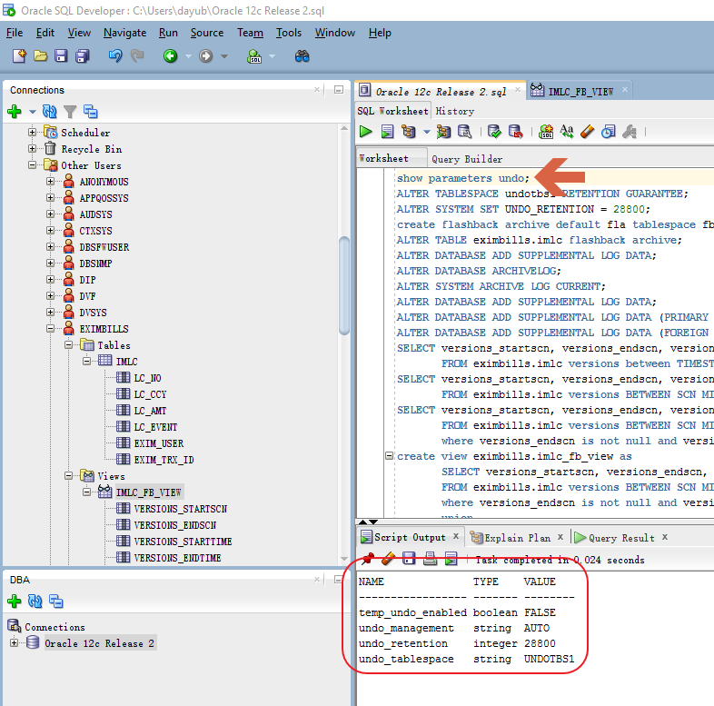

Get Historical Data from Database Log

Oracle Database

**介绍各种从Oracle数据库Log中读取交易历史数据的方法，重点展示Oracle
Flashback技术的各种功能及用法，探讨在Eximbills产品中使用Oracle
Flashback技术的可能性。**

Copyright  2017 China Systems Nanjing

All rights reserved. This product and related documentation are protected by
copyright and distributed under licenses restricting its use, copying,
distribution and decompilation. No part of this product or related documentation
may be reproduced in any form by any means without the prior written
authorization of China Systems Nanjing and its licensors, if any.

| Authors: | Dayu Bian        |
|----------|------------------|
| Version: | 2.0.0            |
| Date:    | April 7, 2017    |
| Project: | Audit Log Report |

Get Historical Data from Database Log: Oracle Database

| File name:          | Get Data from DB Log - Oracle V2.docx                                            |
|---------------------|----------------------------------------------------------------------------------|
| Path name:          | D:\\BitTorrentSync\\Work\\DB History Data\\Get Data from DB Log - Oracle V2.docx |
| Internal reference: | Audit Log Report                                                                 |

DOCUMENT HISTORY

| **Version** | **Date**           | **Narrative**                                    |
|-------------|--------------------|--------------------------------------------------|
| 1.0.0       | September 15, 2011 | First Draft                                      |
| 2.0.0       | April 7, 2017      | Update for Oracle 12c Release 2 and new scenario |
|             |                    |                                                  |

背景描述
========

**历史资料的用途**
------------------

交易及非交易数据的历史资料，对Eximbills这样的银行应用系统来说，在很多地方都会被用到。例如——

-   交易资料的核对、查询与报表;

-   审计功能(Audit);

-   对错误交易的更正(Cancellation)。

**历史资料的保管与获取**
------------------------

一个系统，如何保管历史资料，有两类方法——

-   应用系统自已保管历史资料，在设计时就充分考虑到历史资料的各种可能用途，规划好历史资料的归档、清理等功能。

-   利用数据库Log机制，从Log中获取应用所需的历史资料。

前一种方法，其优点在于既不依赖于数据库的Log实现机制，也不依赖于第三方数据库工具，做到了实现一次、各个数据库都通用。但其缺点在于交易处理时需要额外处理“历史”资料的读写，相对增加了数据库操作，从而会对交易处理的性能产生一定的负面影响。

后一种方法，其优缺点恰好与前者相反。由于主流的关系型数据库，在SQL语句被真正落实到磁盘系统之前，都是要先记数据库交易Log，因此Log中实际已记录了数据的历史记录，利用数据库Log机制保管与获取历史资料，不仅可以通过节省交易处理时对数据库的存取来提高性能，而且可利用数据库Log管理机制实现历史资料的归档、清理。但缺点也很明显，这类方法严重依赖于数据库自身所提供的、非标准化的Log存取接口，或第三方软件工具，实现不了各数据库兼容。

因此，当我们强调应用要兼容各种数据库系统时，多半会采取前一种方法。比如在Eximbills中就有Event表，我们猜测其设计的本意应该是存放Master的历史资料，只不过隨着产品的演进，后来出现了改变Master却不增加Event记录的交易路径，从而给审计功能的实现提了个难题。

相反，当我们强调客户满意度、面对特定用户、遭遇系统性能瓶颈时，则倾向于使用后一种方法。

**获取数据库Transaction Log内容的方法**
---------------------------------------

众所周知，数据库Log并非是以明码、文本方式存放的，所以想获取其内容需费一些周折。

已知的获取Log内容的方式有如下这些——

-   IBM InfoSphere Change Data Capture 一种实时的数据复制/转换工具，直接
    从各种数据库Log中捕获数据变化，并可对数据进行一定的转换处理，最后写入到目标数据库中。
    使用该工具，应用可从目标数据库中以SQL语句获取所需的Log内容。

-   Oracle Golden Gate 与IBM InfoSphere Change Data
    Capture类似的实时数据复制工具，可直接
    从各种数据库Log中捕获数据变化，并可对数据进行一定的转换处理，最后写入到目标数据库中。
    使用该工具，应用可从目标数据库中以SQL语句获取所需的Log内容。

-   Oracle LogMiner Oracle数据库自带的Redo
    Log分析工具，可分析Oracle在线与离线Redo Log，从中得到所有DML(Data
    Manipulation Language)语句，应用可根据这些SQL语句跟踪数据变化。

-   IBM DB2 Recovery Expert DB2数据恢复工具，其Log分析功能可以从DB2 transaction
    log中读取并输出数据变化内容。

-   IBM db2ReadLog API DB2自带的C/C++ API，通过调用这些API，C/C++程序可以读取DB2
    log内容。

-   Oracle Flashback Technology
    Oracle闪回技术是Oracle数据库特有的一系列功能项。利用这些功能项，应用可以用SQL语句查询数据历史记录、事务的回滚SQL语句等有用信息。

**数据库审计的专用工具**
------------------------

如果我们获取数据库Log内容的目的仅仅是为了数据库审计，其实还有两个专门用于数据库安全审计的软件值得考虑：

-   Oracle Audit Vault

-   IBM Security Guardium （以前叫做InfoSphere Guardium)

这两个软件可以从多种数据库中抓取Log，提供全方位的数据安全保护与审计。一些非常通用的企业应用，也会结合这些安全审计工具，定制相应的审计功能。

无庸置疑，这类专用工具当然会提供诸如Before/After之类的报表功能：

Oracle Flashback Technology
===========================

就Oracle数据库而言，Flashback
Technology是系统自带的功能项，无需借助任何其他第三方工具，且使用也非常简便,只要经过一些必要的设置，应用就可以通过SQL语句得到数据库对象过去某个时点的快照。具体的功能描述，请参考Oracle手册：

<http://docs.oracle.com/database/122/ADFNS/flashback.htm#ADFNS1008>

**系统设置**
------------

### UNDO参数设置

可用show parameters undo语句显示Oracle数据库中UNDO参数的设置。

其中undo\_management及undo\_tablespace是安装缺省值，且UNDOTBS1是一个自动扩展的tablespace。而undo\_retention的值是28800秒，也就是8小时，表明UNDO信息保留的时长为8小时。必须注意，undo\_retention所指定的时长是否有效，实际会受UNDOTBS1的大小限制，由于我们这儿的UNDOTBS1是自动扩展的，所以能保证UNDO信息保留8小时。下图为UNDOTBS1的相关设置：

### Flashback Data archive设置

对于超出undo\_retention时长的交易历史记录，Undo Management将会自动从UNDO
tablespace中移除。为将交易历史记录保留更长时间，Oracle提供了Flashback Data
Archive功能。

为使用些功能 ，我们首先建立了一个NOLOGGING的tablespace——FBATBS，如下图所示：

>   [./media/image4.png](./media/image4.png)

然后，使用下面SQL语句建立一个缺省的Flashback Archive:

create flashback archive default *fla* tablespace *fbatbs* retention *30 day*;

这里的retention指定了交易历史记录在flashback
archive中保留的时长，单位可以是天、月、年。

最后，使用alter table语句一一指定各个需要保留历史记录的表：

ALTER TABLE eximbills.imlc flashback archive;

### Flashback Transaction Query设置

如果我们需要查询在一个数据库事务中做了哪些数据更新，则需要做如下设置：

>   ALTER DATABASE ADD SUPPLEMENTAL LOG DATA;

### Flashback Transaction设置

如果我们希望通过调用过程DBMS\_FLASHBACK.TRANSACTION\_BACKOUT回滚已提交的数据库事务，则需要做如下设置(第一条命令需要数据库以startup
mount方式启动，此时数据库在非Open状态下，才能被正确执行)：

>   ALTER DATABASE ARCHIVELOG;

>   ALTER SYSTEM ARCHIVE LOG CURRENT;

>   ALTER DATABASE ADD SUPPLEMENTAL LOG DATA;

>   ALTER DATABASE ADD SUPPLEMENTAL LOG DATA (PRIMARY KEY) COLUMNS;

>   ALTER DATABASE ADD SUPPLEMENTAL LOG DATA (FOREIGN KEY) COLUMNS;

*需要注意的是，在真正的银行生产环境中，Eximbills所使用的数据库用户不会是DBA，所以除上述设置项目外，还会涉及到一些数据库权限设置，具体方法请参阅相关文档。*

**功能运用**
------------

接下去的两幅图，分别显示了Flashback Version Query与Flashback Transaction
Query的具体效果：

*需要注意的是，我们在实际测试中发现，Flashback Version
Query有一个短暂的延时，即交易提交后，我们虽可通过Flashback Version
Query立即查询到之前的最新版本的栏位versions\_endscn与versions\_endtime从null变为相应的时间戳，但当前最新版本却不会立刻显现于Flashback
Version Query。总之，会有一个短暂的延时。*

在Eximbills中使用Oracle Flashback Technology 
---------------------------------------------

从前面的演示效果，我们不难发现，利用Oracle Flashback Version
Query，Eximbills可以回溯数据库记录的演进历史，从而可据此实现对历史数据的查询、生成
Audit Log Report、得到Cancellation所需的历史记录。利用Oracle Flashback
Transaction Query，我们甚至可以得到Cancellation所需的Undo SQL语句。

为更为详细地演示Oracle Flashback
Technology，我们建立了eximbills.imlc表，具体表结构如下图所示：

为了得到Before/After Value Report的效果，我们使用如下SQL建立了一个View:

create view eximbills.imlc\_fb\_view as

SELECT versions\_startscn, versions\_endscn, versions\_starttime,
versions\_endtime, versions\_xid, 'B' as versions\_operation, lc\_no, lc\_ccy,
lc\_amt, lc\_event, exim\_user, exim\_trx\_id

FROM eximbills.imlc versions BETWEEN SCN MINVALUE AND MAXVALUE

where versions\_endscn is not null and versions\_endscn in (select
versions\_startscn from eximbills.imlc versions BETWEEN SCN MINVALUE AND
MAXVALUE where versions\_startscn is not null)

union

SELECT versions\_startscn, versions\_endscn, versions\_starttime,
versions\_endtime, versions\_xid, versions\_operation, lc\_no, lc\_ccy, lc\_amt,
lc\_event, exim\_user, exim\_trx\_id

FROM eximbills.imlc versions BETWEEN SCN MINVALUE AND MAXVALUE;

针对上述view，使用如下SQL：

select \* from eximbills.imlc\_fb\_view where versions\_operation is not null
order by lc\_no, versions\_endtime asc, versions\_operation desc;

则得到下面图中的结果：

当然，我们也可以不用如此复杂的SQL语句、转而在程序中直接操纵数据集得到完全相似的结果。

这里强调一下，在使用Oracle Flashback Technology时，我们需要注意以下几点：

-   Flashback Version Query的响应有一定延时;

-   Flashback Version
    Query所返回的结果中没有数据库用户信息，因此需要应用在相应表中增加用户信息字段，并在更新数据库资料时同时更新这些字段;

-   Flashback Version Query所返回的结果中不包括直接的SQL
    Delete信息，但Delete的效果体现在versions\_endscn及versions\_endtime栏位的值上。

小结
====

有若干种方法从数据库Log中读取交易的历史记录，就Oracle数据库而言，Flashback
Technology是数据库自带的功能，只需在数据库上进行一些设置就可打开这些功能，而且其接口形式为SQL语句，故兼容于基于JDBC的各种报表工具，应用方面需要进行的改动也较小，可作为设计Audit
Log Report功能的备选方案。

Sign-off Sheet
==============

| Internal Reference:   |                      |             |        |
|-----------------------|----------------------|-------------|--------|
| Version:              |                      |             |        |
| Authors:              |                      |             |        |
| Sign off Required by: |                      |             |        |
| *Reviewed by*         | *Position / Comment* | *Signature* | *Date* |
|                       |                      |             |        |
|                       |                      |             |        |
|                       |                      |             |        |
|                       |                      |             |        |
|                       |                      |             |        |
|                       |                      |             |        |
|                       |                      |             |        |
|                       |                      |             |        |
|                       |                      |             |        |
