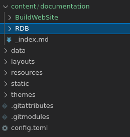
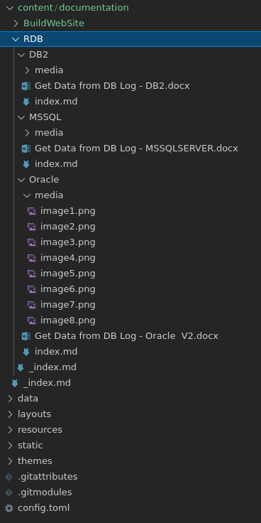

We add content for our site under the **content root directory** of our Hugo site project, either content/ or a 
language-specific root like conten/en/. Because most technical documentation sites have different sections for
different types of content, the Docsy theme comes with the following templates for top-level site sections:

1. *docs* is for pages in our site’s Documentation section.
2. *blog* is for pages in our site’s Blog.
3. *community* is for our site’s Community page.

We'll create a new section under the *docs* for those documents converted from MS DOCX.

Detailed Instructions:
======================

-   Step 1
>
> Create a new directory under content/documentation/ of our Hugo site project. In this case, The new dirctory is
> *RDB*.
>

-   Step 2
>
> Put a file named _index.md into the directory. The content of this file looks like this:
>```
>---
>title: "Example - RDB Log"
>weight: 20
>type: docs
>summary: How to get data from RDB Log.
>---
>
># Get Data from RDB Log
>
>How to get data from RDB Log?
>```

-   Step 3
> Create sub-directories for each docx file, and put converted files into these directories.
>

-   Step 4
> For each index.md converted from docx, add Docsy header like this:
>```
>---
>title: "Get Data from Oracle Log"
>weight: 10
>type: docs
>description: >
>    A example to show how to get historical data from Oracle Log.
>---
>```
> You may find the completed files at <https://github.com/DAYUCS/word2md>.