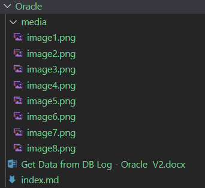

Pandoc is a Haskell library for converting from one markup format to
another (<https://pandoc.org/>).

We'll install it on Ubuntu and convert files from Microsoft Word docx to
Markdown.

Detailed Instructions:
======================

-   Step 1
>
> Run update command to update package repositories and get latest
> package information.
>```
>sudo apt update
>```

-   Step 2
>
> Run the install command to install the packages and dependencies.
>```
>sudo apt install pandoc
>```

-   Step 3
> Run Pandoc command to check the installation.
>```
>pandoc --version
>```

-   Step 4
>
> Run Pandoc command to convert docx to Markdown file and extract images
> that the docx contains.
>```
>pandoc -f docx -t markdown 'Get Data from DB Log - Oracle V2.docx' -o index.md --extract-media=.
>```
>
> 
