|  EXIMBILLS © Trade Finance System  Customer Enterprise Version 3\.3\.6  Archiving and Recovery  July 2021                                                                                                                                                                                                                                                                                                                                                                                                                                                                                                                                                                                                                                                                                                                                                                                                                                                                                                                                                                                                                                                                                                                                                                                                                                                                                                                                                                                                                                                                                                                |
| :-------------------------------------------------------------------------------------------------------------------------------------------------------------------------------------------------------------------------------------------------------------------------------------------------------------------------------------------------------------------------------------------------------------------------------------------------------------------------------------------------------------------------------------------------------------------------------------------------------------------------------------------------------------------------------------------------------------------------------------------------------------------------------------------------------------------------------------------------------------------------------------------------------------------------------------------------------------------------------------------------------------------------------------------------------------------------------------------------------------------------------------------------------------------------------------------------------------------------------------------------------------------------------------------------------------------------------------------------------------------------------------------------------------------------------------------------------------------------------------------------------------------------------------------------------------------------------------------------------------------------------------------: |
| *Copyright* *2021* *© China Systems Corporation*  *All Rights Reserved*    *This document is protected by United States Copyright Law and may contain Trade Secrets Information which is proprietary to China Systems Corporation\.  No part of this document may be copied, photocopied, reproduced, translated, distributed, or reduced to any electronic medium or machine\-readable form without prior consent in writing from China Systems Corporation\.  The information in this document may be used only under the terms and conditions of separate China Systems Corporation license agreements\.*  *Information is subject to change without notice\.  China Systems Corporation makes no warranties, either expressed or implied, with respect to the software herein described as to its quality, performance, including, without limitations to, its fitness for any particular purpose\.*  *This document may not reflect total system capability at any subsequent date as a result of development\.  It is also possible that it may contain references to facilities not available on your computer system\.  Such references should not be construed to mean that these facilities will necessarily be made available on all types of computer hardware or in all user locations\.*  *China Systems Corporation accepts no responsibility or liability for any damages or loss of business or revenue due to the use of this document\.*  *All trademarks, registered trademarks and trade names mentioned in this document are the sole property of their respective holders\.* |
| ORDER MORE EXIMBILLS DOCUMENTATION  Additional copies of Documentation are available for purchase from China Systems Corporation or through your local EXIMBILLS Support Office\.                                                                                                                                                                                                                                                                                                                                                                                                                                                                                                                                                                                                                                                                                                                                                                                                                                                                                                                                                                                                                                                                                                                                                                                                                                                                                                                                                                                                                                                       |
|   CHINA SYSTEMS CORPORATION  Comments may be addressed to:  <u>[corporatedocs@chinasystems\.com](mailto:corporatedocs@chinasystems.com)</u>  China Systems Corporation Ltd\.  Corner House, 20 Parliament Street  Hamilton HM12  Bermuda                                                                                                                                                                                                                                                                                                                                                                                                                                                                                                                                                                                                                                                                                                                                                                                                                                                                                                                                                                                                                                                                                                                                                                                                                                                     |

Table of Contents

[CE Documentation Library](<error reading>)

[CE Documentation Library](<error reading>)

[Core System Manuals](<error reading>)

[CE Utility Reference Manuals](<error reading>)

[Installation Guides](<error reading>)

[Introduction](<error reading>)

[System Overview](<error reading>)

[Manual Overview](<error reading>)

[Using the CE Utility](<error reading>)

[Running the CE Utility](<error reading>)

[Preparing the CE Utility Files](<error reading>)

[Accessing the CE Utility](<error reading>)

[Navigating the CE Utility Interface](<error reading>)

[Generating the XML Parameter Files](<error reading>)

[Building a Product](<error reading>)

[Archiving Prerequisites](<error reading>)

[Archiving / Backup Database Settings](<error reading>)

[Data Source Settings](<error reading>)

[WebSphere Data Source Settings](<error reading>)

[CE Utility Data Source Settings](<error reading>)

[Log Settings](<error reading>)

[Manual Archive Mode](<error reading>)

[Overview](<error reading>)

[Common Parameter Settings](<error reading>)

[Archive Control Component](<error reading>)

[Archive Product Items](<error reading>)

[Error Codes](<error reading>)

[JSP and JS Settings](<error reading>)

[Archive Data Function](<error reading>)

[Parameter Settings](<error reading>)

[Transaction Process](<error reading>)

[Restore Archived Data Function](<error reading>)

[Parameter Settings](<error reading>)

[Transaction Process](<error reading>)

[Inquire Archived Data Function](<error reading>)

[Parameter Settings](<error reading>)

[Transaction Process](<error reading>)

[Auto Archive Mode](<error reading>)

[Overview](<error reading>)

[Parameter Settings](<error reading>)

[Transaction Process](<error reading>)

[Archiving through STP](<error reading>)

[Overview](<error reading>)

[Parameter Settings](<error reading>)

[Transaction Process](<error reading>)

[Sample Archiving JSP and JS Files](<error reading>)

[IMLC\_ArchiveCriteria\.jsp](<error reading>)

[IMLC\_ViewArchive\.jsp](<error reading>)

[IMLC\_ViewArchive\_Function\.JS](<error reading>)

[IMLC\_ViewArchive\_Event\.JS](<error reading>)

[Glossary](<error reading>)

[Glossary](<error reading>)

CE Documentation Library

CE Documentation Library

The CE Documentation Library lists all available manuals that serve as references on the use of the Customer Enterprise system\. The documents are categorized into three groups: Core System Manuals, CE Utility Reference Manuals, and Installation Guides\.

Core System Manuals

The CE core system manuals provide details on the setup and configuration of various CE parameters, as well as the implementation of supplementary functionalities supported by the system\.

Archiving and Recovery

This manual is a reference to the Archive and Recovery functionality of the CE system\. Discussions include the required parameter settings for configuring the relevant functions, as well as examples of how this functionality is used in transaction processes\.

Building a Product

This manual is a reference to the process of building a product in CE\.  It provides step\-by\-step procedures on how to create a basic CE module, transaction function, and product setting; configure parameters; and attach components to generate a working business product\.

Data Objects

This manual serves as a reference for creating and utilizing data objects in the CE system\.  The discussions provide details on how to build data object templates and data object entities, and how to attach these to the transaction function screen\.

Frequently Asked Questions

This document addresses commonly\-asked questions on the Customer Enterprise system\.  Issues on the browser\-side \(transaction processing\), CE Utility, Security Module, and database, among others, are addressed in the discussions\.

Interfacing CE with CS Eximbills

This document discusses the process of interfacing CE with the CS Eximbills \(CSX\) back office system\. Employing the MQ, FTP, and TCP/IP communication protocols, the interface process using the XML format is detailed in this document\.

Interfacing CE with Eximbills Enterprise

This document discusses the process of interfacing CE with the Eximbills Enterprise \(EE\) back office system\.  Employing the MQ protocol, the interface process for the transfer of data between CE and EE using the XML format is detailed in this document\.

Log Settings

This manual provides details on CE logs as well as general instructions on log configuration in CE\.  This is especially written for the users who are in charge of maintaining the CE system\.

Look and Feel

This manual is a reference guide on designing the CE user interface \(i\.e\., the look and feel of the system\)\.  Divided into two parts, the manual provides instructions on creating a\) the basic L&F style of CE; and b\) the CE L&F style that incorporates widgets\.

Multi\-Entity

This manual is a reference on implementing the Multi\-Entity functionality of the CE system\.  Discussions cover the implementation and application of CE multi\-entity\.

Multi\-Language

This manual discusses the procedures required in setting up the Multi\-Language functionality of CE as it is run by Administrator\- and Operator\-type users\. Furthermore, the configuration of certain system and browser elements as well as the setup of related system parameters is explained in step\-by\-step procedures\.

Reports

This manual is a comprehensive reference guide on the requirements and processes involved in building business products and functions that generate online reports and documents\.

Security and System Maintenance Functions

This manual is a comprehensive guide on the security and system maintenance of the CE system\.  As such, it includes detailed instructions for company and company function management, and user and user function management\.  Maintenance of key functionalities such as authorization rules, reference numbers, and other services is covered as well\. In addition, this document discusses the security concepts in CE to assist users assigned with access rights to the CE Security Module\.

Standing Data Functions

This document discusses the functions for the CE standing data that are maintained by operators \(e\.g\., parties, clauses\)\.  It includes sections for each function, starting with a brief description of the function, followed by the function input when necessary, and the procedure steps\.

Supplementary Functions

This manual is a reference for the CE Utility operator user in configuring parameter, JSP, and transaction function settings to define special or supplementary CE functionalities such as uploading images; sending images and forms to the back\-office system; and sending notifications via e\-mail, SMS, and widgets\.

System Administration Functions

This manual is a reference for the default Super Administrator user of the CE Utility in the configuration and maintenance of the CE environment\.  It discusses in detail user management and parameter management\.

System Reference

This document serves as a quick reference to the following elements that are used when configuring specific parameters in the CE Utility: global system parameters, system parameters, components, XML Generator items, server side system methods, system JS methods, and APIs\.

CE Utility Reference Manuals

The CE Utility Reference set of manuals is a guide on the use of the Customer Enterprise Utility Workbench, or simply CE Utility\.  This reference provides details on every function or feature in the CE Utility and includes instructions and step\-by\-step procedures on how to operate or use the function in relation to operating and maintaining the CE system and processing a business transaction\.

A manual is provided for each function group of the CE Utility: 

*CE Utility* *Reference:* *User Manager Functions*, for the functions that belong to the User Manage function group of the CE Utility when accessed by an Administrator or Operator user

*CE Utility* *Reference:* *Parameter Manager Functions*, for the functions that belong to the Parameter Manage function group of the CE Utility when accessed by an Administrator or Operator user

*CE Utility* *Reference:* *System Functions*, for the functions that belong to the System Function group of the CE Utility\.

*CE Utility* *Reference:* *Transaction Functions*, for the functions that belong to the Transaction Function group of the CE Utility\.

*CE Utility* *Reference:* *Product Functions*, for the functions that belong to the Product Function group of the CE Utility\.

*CE Utility* *Reference:* *Maintenance Functions*, for the functions that belong to the Maintenance function group of the CE Utility\.

Installation Guides

The CE installation guides are references on the installation and setup processes of the CE system on different application servers and databases\.

**Installation Guide WAS** **9** **\- Oracle** **19c**

This is a reference for installing the CE system on WebSphere Application Server Version 9\.0\.5\.6, with an Oracle 19c database\.  This includes detailed instructions on configuring the components that are required to successfully run CE\.

Introduction

System Overview

Manual Overview

System Overview

Transactions that are old, completed, or canceled consume much disk space that is better used to store future records\.  Moreover, this slows down transaction processes\.  While these types of records can simply be deleted, there is no way to retrieve them for inquiry or any subsequent process\. 

The Archiving and Recovery functionality of CE addresses these setbacks\. Archiving is the process of transferring transaction records from the Transaction Database to the Backup Database\. Recovery, on the other hand, is the process of retrieving archived records from the Backup Database\. Recovered records may be used for other operations or inquiry, depending on the bank's requirements\.

Archived data include master file transaction data and the associated data such as documents, images, GAPI, e\-mails, and forms\.

Run by bank operators, the Archiving functions in CE can only be created for transaction modules\.  These functions are Archive Data, Inquire Archived Data, and Restore Archived Data\. 

There are two modes of archiving:

Manual Archiving, in which records are manually archived per module according to a set of defined criteria\.  In addition, records received via STP can also be archived through this mode\.

Auto Archiving, in which records are automatically archived by batch according to a set of defined criteria\. This is also called Batch Archiving\.

Creating Archiving functions requires specific installation, database, and parameter settings\.

Manual Overview

<u>**Purpose**</u>

This manual is a reference to the Archive and Recovery functionality of the CE system\. Discussions include the required parameter settings for configuring the relevant functions, as well as examples on how this functionality is used in transaction processes\. 

The archiving functions discussed in this document are manual Archiving functions \(Archive Data, Restore Archived Data, and Inquire Archived Data\), Batch Archive function, and STP Archive function\.

<u>**Audience**</u>

This document is written specifically for, but not limited to, the following users: 

Consultants tasked to implement the Archive and Recovery functions in a business module\.  These users must have sufficient knowledge of running CE Utility functions, building a product, and installing the CE system\.

Bank or browser\-side users in charge of processing, managing, and maintaining transaction records\.

<u>**Prerequisites**</u>

Sufficient knowledge of building business products is required\. Recommended titles before reading this manual are as follows:

*CE* *Building a* *Product*

*C**E Installation Guide*

*C**E System Administration Functions*

*CE Utility References*

**NOTE:** Some features discussed in this manual have been tested and documented based on an older system version\.  Unless otherwise specified, the overall functionality is the same when recreated in the current version\.

Using the CE Utility

Running the CE Utility

Generating the XML Parameters

BUILDING A PRODUCT

Running the CE Utility

The Customer Enterprise Utility Workbench, or CE Utility, is the main tool for building parameters in CE\.

Preparing the CE Utility Files

Along with the installation files, the CE Utility folder is provided with every CE system release\. Prior to using the CE Utility, do the following:

Copy the CE Utility folder to the local drive\.

Define the required environment variables\.

Map the CE directories \(e\.g\., CEWeb\.war and CE\_PARA\) to the network drive\.

| 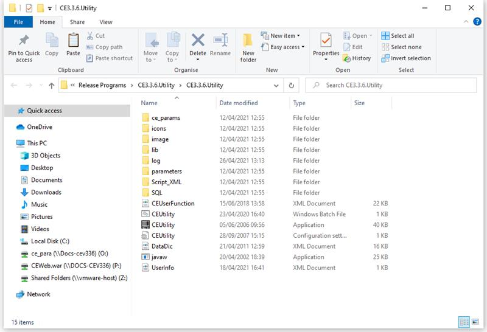 |
| :-----------------------------------------------------------: |

***Figure 2\.*** ***1*** ***CE Utility Folder***

**NOTE:** 

The default drives defined in the GEN\_XML\_ROOTPATH and GEN\_WEB\_ROOTPATH system parameters are O:\ and P:\ respectively\. These drives, if currently not existing, may be created through a batch file\. While O:\ and P:\are the default drives for CE, these may be set to any other preferred drive available in the network\. 

To enable users to use the CE Utility on their own local machines as clients connecting to the CE server: 1\) Install the Java Development Kit \(JDK\) program; 2\) Copy the CE Utility folder; 3\) Create the JAVA\_HOME environment variable, which must point to this directory: \[Java Home\]\\[Installed JDK\]\.

For more information on setting up the CE environment, refer to the CE installation guides*\.* 

For information on the CE Utility functions, refer to the *CE Utility Reference* manuals\.

| **Batch File for Creating the CE Drives**  The batch file for creating drives contains the following commands:    subst O: /d  subst P: /d  subst O: C:"\Program Files\IBM\WebSphere\AppServer\profiles\AppSrv01\installedApps\DOCS\-CEV336Node01Cell\CE\.ear\CE\_PARA"  subst P: C:"\Program Files\IBM\WebSphere\AppServer\profiles\AppSrv01\installedApps\DOCS\-CEV336Node01Cell\CE\.ear\CEWeb\.war"      |
| ------------------------------------------------------------------------------------------------------------------------------------------------------------------------------------------------------------------------------------------------------------------------------------------------------------------------------------------------------------------------------------------------------------------------------------------------------------------------------------------------------------------------ |

Accessing the CE Utility

The main program for running the CE Utility is the CEUtility\.bat file, which is found in the CE Utility folder\.

| **Do the following \. \.** **\.** |
| ------------------------------------------------------------------------------------------------------- |

| Run the CEUtility batch program to access the CE Utility\.    <u>**NOTE**</u>:  A shortcut for the CEUtility batch file can be created on the desktop for easy access\.                                                                                                                                                                                                                                                                                                                                                         |      |  |
| ---------------------------------------------------------------------------------------------------------------------------------------------------------------------------------------------------------------------------------------------------------------------------------------------------------------------------------------------------------------------------------------------------------------------------------------------------------------------------------------------------------------------------------------------------------------------------------------------------------------------------------------------------------- | ---- | :-----------------------------------------------------------: |
|                                                                                                                                                                                                                                                                                                                                                                                                                                                                                                                                                                                                                                                            |      |                                                               |
| The logon window of the CE Utility is displayed\.  To define the database information, click on the Profile button\.                                                                                                                                                                                                                                                                                                                                                                                                                                                                                                                                 |      |  |
|                                                                                                                                                                                                                                                                                                                                                                                                                                                                                                                                                                                                                                                            |      |                                                               |
| In the Database Information dialog box that is displayed, specify the required database details and click on the Save button\.                                                                                                                                                                                                                                                                                                                                                                                                                                                                                                                             |      |  |
|                                                                                                                                                                                                                                                                                                                                                                                                                                                                                                                                                                                                                                                            |      |                                                               |
| A confirmation message is displayed\. Click on the OK button\.                                                                                                                                                                                                                                                                                                                                                                                                                                                                                                                                                                                             |      | 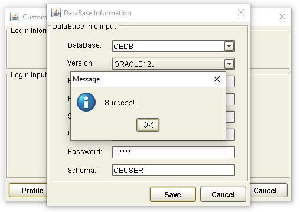 |
|                                                                                                                                                                                                                                                                                                                                                                                                                                                                                                                                                                                                                                                            |      |                                                               |
| <u>**NOTE**</u>:  This new data source setting is saved in the UserInfo\.xml file in the CE Utility directory\.                                                                                                                                                                                                                                                                                                                                                       |      |  |
|                                                                                                                                                                                                                                                                                                                                                                                                                                                                                                                                                                                                                                                            |      |                                                               |
| The relevant username and password may then be specified for logging on the CE Utility\.    <u>**NOTE**</u>:  For information on defining CE Utility user profiles, refer to the *CE System Administration Functions* manual\.                                                                                                                                                                                                                            |      |  |
|                                                                                                                                                                                                                                                                                                                                                                                                                                                                                                                                                                                                                                                            |      |                                                               |
| The CE Utility window is displayed\.                                                                                                                                                                                                                                                                                                                                                                                                                                                                                                                                                                                                                       |      |  |
|                                                                                                                                                                                                                                                                                                                                                                                                                                                                                                                                                                                                                                                            |      |                                                               |
| A function is accessed by opening or double\-clicking on the relevant function group and clicking on the function name\.  <u>**NOTE**</u>:  A user may only access and utilize the functions assigned to him\.  For more details, refer to the *CE Utility Reference**:* *User Manager Functions* documentation*\.* |      |  |

**NOTE:** It is sometimes necessary to assign a new user name and password when the new database is restored from a backup file\.  Restoring the backup file restores the original user profiles\.

The new user profiles for the CE Utility \(as well as the CE Security Module\) can be defined during the installation process\.  SQL scripts are run to create these profiles\.  Refer to the CE installation guides for more information\.

Navigating the CE Utility Interface

After logging on, the CE Utility window is displayed and parameters may then be configured\. The functions used for setting up parameters may be accessed by clicking on the function name on the Function menu or by using the shortcut buttons\.

The CE Utility interface also provides ways by which parameters can be created, edited, deleted or linked to other operations: menu bar, toolbar buttons, and popup menu\.

|  |
| :-----------------------------------------------------------: |

***Figure 2\.*** ***2*** ***The CE Utility Interface***

**NOTE:** A function is only displayed, and its corresponding button or menu option enabled, if the user has been given the right to access this function\.  Some options and functions are only available to Super Administrator users, while others are only accessible to Administrator and Operator users\.

CE Utility Functions

The functions that may be accessed for setting up parameters are organized together into several function groups\. The current available function groups and their corresponding functions in the CE Utility are as follows:

**User Manager Function Group**

This function group is comprised of functions used for creating, configuring, and exporting Bank\-Country group settings; creating new users; and configuring data sources\. These functions are:

Business Unit Config

DataSource Manage

Import/Export Business Unit

User Manage

**Parameter Manage Function Group**

This function group consists of functions used for maintaining system\-wide parameters and components\. These functions are:

AP Server

Component Manage

Language Configuration

System Parameter

System Parameters

**System Function Group**

This function group consists of functions used for maintaining and facilitating system\-wide tasks, operations, and settings\. These functions are:

Image Type Maintain

Output Device

Queue Manager

STP Setting

Time Zone

**Transaction Function Group**

This function group is comprised of functions used for defining the actual business parameters of transaction functions\.  These facilitate the maintenance and processes of the business transaction modules\. These functions are:

Amount/Rate Format

Batch Manage

Clause

DO Get Data

Export Setting

Form

GAPIs Setting

Get Data

Image Control

Message Broker Setting

Module & Event

Report Template

STPs Mapping

Sub Tasks

SWIFT Config

System Maintain

Transaction Function

Transfer To

TSU Mapping

Upload Message Setting

Web Service Setting

Widget Maintain

**Product Function Group**

This function group consists of functions that are used for creating and configuring the products to be accessed and used by the customers or end\-users\. These functions are:

Fields Select

Inbox

Product Authorize

Product Authorize Setting

Product Catalog

Product Function Setting

Product Item

**Maintenance Function Group**

This function group is comprised of functions used for facilitating the maintenance of data from CE tables, including fields and error settings\. These functions are:

DB Dictionary

Error Handling

Error Message Config \(CE\)

Field Conversion

Multi Language

Page Dictionary

XML Generator

Menu Bar

The options on the menu bar are shortcuts to both the common and specific functions and tasks of the system\.

|  |
| :-----------------------------------------------------------: |

***Figure 2\.*** ***3*** ***Menu Bar***

| **Menu** |      | **Description** |
| :-----------------------------------------: | :--: | :------------------------------------------------: |

| **File**     |      | The available options in the File menu are:  New: This is used for creating a new parameter or rule\.  Save: This is used for saving the created or modified settings\.  Close Function: This is used for closing the current function window\.  Connect To: This is used for connecting to another Meta data source\.  Log Off: This is used for logging off a user that is logged on to the system without exiting the system\.  Exit: This is used for closing the system window and exiting the system\.                                                                                                                                                  |
| -----------: | ---- | ------------------------------------------------------------------------------------------------------------------------------------------------------------------------------------------------------------------------------------------------------------------------------------------------------------------------------------------------------------------------------------------------------------------------------------------------------------------------------------------------------------------------------------------------------------------------------------------------------------------------------------------------------------------------------------------------- |
|              |      |                                                                                                                                                                                                                                                                                                                                                                                                                                                                                                                                                                                                                                                                                                   |
| **Edit**     |      | The available options in the Edit menu are:  Add: This is used for adding a setting for the selected function or parameter\.  Delete: This is used for deleting or removing an existing setting\.  Edit: This is used for editing or modifying existing settings\.  Copy: This is used for copying or duplicating a selected setting\.  Find: This is used for finding a specific setting\.                                                                                                                                                                                                                                                                         |
|              |      |                                                                                                                                                                                                                                                                                                                                                                                                                                                                                                                                                                                                                                                                                                   |
| **Function** |      | The available options in the Function menu are:  User Manage, which displays options for running User Manager functions  Parameter Manage, which displays options for running Parameter Manager functions  System Function, which displays options for running System functions  Transaction Function, which displays options for running Transaction functions  Product Function, which displays options for running Product functions  Maintenance, which displays options for running Maintenance functions                                                                                                                                                |
|              |      |                                                                                                                                                                                                                                                                                                                                                                                                                                                                                                                                                                                                                                                                                                   |
| **Tools**    |      | The available options in the Tools menu are:  Toolbar: When this option is marked, the toolbar is displayed on the CE Utility Workbench window\.  Function Toolbar: When this option is marked, the function toolbar is displayed on the CE Utility Workbench window\.   Set User Profile DB Info: This option is used by the Super Administrator user to change the user information that is to be used by the CE Utility for connecting to a database\.   Window Style: Selecting this option displays a list of CE Utility interface styles: Microsoft Style, Unix Style, Java Style, Classic Style, and Metal Style\. The preferred style may be marked accordingly\. |
|              |      |                                                                                                                                                                                                                                                                                                                                                                                                                                                                                                                                                                                                                                                                                                   |
| **Help**     |      | The available options in the Help menu are:  Help Topics: This is *currently not used*\.  Content Help: This is *currently not used\.*  About Customer Enterprise: Selecting this option displays the About Customer Enterprise window, which indicates the version information of CE\.                                                                                                                                                                                                                                                                                                                                                                                         |

Toolbar Buttons

There are two kinds of toolbars in the CE Utility: the basic toolbar and the function toolbar\.

**Basic Toolbar**

The following standard buttons are available on the Basic Toolbar of the CE Utility window\. These are used for performing the basic and common tasks of the system\. 

|  |
| :-----------------------------------------------------------: |

***Figure 2\.*** ***4*** ***Basic Toolbar Buttons***

| **Button** |      | **Description** |
| :-------------------------------------------: | :--: | :------------------------------------------------: |

|  **New**                       |      | This button is used for creating a new parameter or rule\.                          |
| ------------------------------------------------------------------------------------------: | ---- | ----------------------------------------------------------------------------------- |
|                                                                                             |      |                                                                                     |
|  **Add**                       |      | This button is used for adding a setting for the selected function or parameter\.   |
|                                                                                             |      |                                                                                     |
|  **Save**                      |      | This button is used for storing created or modified settings\.                      |
|                                                                                             |      |                                                                                     |
|  **Edit**                      |      | This button is used for editing or modifying existing settings\.                    |
|                                                                                             |      |                                                                                     |
|  **Copy**                      |      | This button is used for copying or duplicating a selected setting\.                 |
|                                                                                             |      |                                                                                     |
|  **Delete**                    |      | This button is used for deleting or removing an existing setting\.                  |
|                                                                                             |      |                                                                                     |
|  **Find**                      |      | This button is used for finding an existing setting\.                               |
|                                                                                             |      |                                                                                     |
|  **Close Function**            |      | This button is used for closing a function window\.                                 |
|                                                                                             |      |                                                                                     |
|  **Help Topic**                |      | This button is *currently not used\.*                                               |
|                                                                                             |      |                                                                                     |
|  **About Customer Enterprise** |      | This button is used for displaying the version information of Customer Enterprise\. |

**Function Toolbar**

The buttons on this toolbar are shortcuts to some of the functions that are in the Function Group lists of the CE Utility window\. The buttons may also be accessed from the Function menu on the menu bar\.

|  |
| :-------------------------------------------------------------------: |

***Figure 2\.*** ***5*** ***Function Toolbar Buttons***

| **Button** |      | **Description** |
| :-------------------------------------------: | :--: | :------------------------------------------------: |

|  **Set System Parameter**               |      | This button is used for accessing the System Parameter function\. The function may also be accessed from the Parameter Manage group in the Function menu\.   |
| ---------------------------------------------------------------------------------------------------: | ---- | ------------------------------------------------------------------------------------------------------------------------------------------------------------ |
|                                                                                                      |      |                                                                                                                                                              |
|  **Manage Component**                   |      | This button is used for accessing the Component Manage function\. The function may also be accessed from the Parameter Manage group in the Function menu\.   |
|                                                                                                      |      |                                                                                                                                                              |
|  **Calculation**                        |      | This button is *currently not used\.*                                                                                                                        |
|                                                                                                      |      |                                                                                                                                                              |
|  **Module/Event Configuration**         |      | This button is used for accessing the Module & Event function\. The function may also be accessed from the Transaction Function group in the Function menu\. |
|                                                                                                      |      |                                                                                                                                                              |
|  **Transaction Function Configuration** |      | This button is used for accessing the Transaction Function\. The function may also be accessed from the Transaction Function group in the Function menu\.    |
|                                                                                                      |      |                                                                                                                                                              |
|  **Form Set**                           |      | This button is used for accessing the Form function\. The function may also be accessed from the Transaction Function group in the Function menu\.           |
|                                                                                                      |      |                                                                                                                                                              |
|  **Accounting Rule Setting**            |      | This button is *currently not used\.*                                                                                                                        |
|                                                                                                      |      |                                                                                                                                                              |
|  **Field Conversion**                   |      | This button is used for accessing the Field Conversion function\. The function may also be accessed from the Maintenance group in the Function menu\.        |
|                                                                                                      |      |                                                                                                                                                              |
| **Get Data**                            |      | This button is used for accessing the Get Data function\. The function may also be accessed from the Transaction Function group in the Function menu\.       |
|                                                                                                      |      |                                                                                                                                                              |
|  **Reference Number**                   |      | This button is *currently not used\.*                                                                                                                        |
|                                                                                                      |      |                                                                                                                                                              |
|  **Output Device**                      |      | This button is used for accessing the Output Device function\. The function may also be accessed from the System Function group in the Function menu\.       |
|                                                                                                      |      |                                                                                                                                                              |
|  **Function Group**                     |      | This button is *currently not used\.*                                                                                                                        |
|                                                                                                      |      |                                                                                                                                                              |
|  **Clause**                             |      | This button is used for accessing the Clause function\. The function may also be accessed from the Transaction Function group in the Function menu\.         |
|                                                                                                      |      |                                                                                                                                                              |
|  **SWIFT**                              |      | This button is used for accessing the SWIFT Config function\. The function may also be accessed from the Transaction Function group in the Function menu\.   |
|                                                                                                      |      |                                                                                                                                                              |

|  **Queue Manager**               |      | This button is used for accessing the Queue Manager function\. The function may also be accessed from the System Function group in the Function menu\.               |
| --------------------------------------------------------------------------------------------: | ---- | -------------------------------------------------------------------------------------------------------------------------------------------------------------------- |
|                                                                                               |      |                                                                                                                                                                      |
|  **GAPIs Setting**               |      | This button is used for accessing the GAPIs Setting function\. The function may also be accessed from the Transaction Function group in the Function menu\.          |
|                                                                                               |      |                                                                                                                                                                      |
|  **Time Zone**                   |      | This button is used for setting time zone\. The function may also be accessed from the System Function group in the Function menu\.                                  |
|                                                                                               |      |                                                                                                                                                                      |
|  **STP Setting**                 |      | This button is used for accessing the STP Setting function\. The function may also be accessed from the System Function group in the Function menu\.                 |
|                                                                                               |      |                                                                                                                                                                      |
|  **Message Broker Setting**      |      | This button is used for accessing the Message Broker Setting function\. The function may also be accessed from the Transaction Function group in the Function menu\. |
|                                                                                               |      |                                                                                                                                                                      |
|  **Processing Center**           |      | This button is *currently not used\.*                                                                                                                                |
|                                                                                               |      |                                                                                                                                                                      |
|  **Amount Format Setting**       |      | This button is used for accessing the Amount/Rate Format function\. The function may also be accessed from the Transaction Function group in the Function menu\.     |
|                                                                                               |      |                                                                                                                                                                      |
|  **Error Message**               |      | This button is used for accessing the Error Message Config \(CE\) function\. The function may also be accessed from the Maintenance group in the Function menu\.     |
|                                                                                               |      |                                                                                                                                                                      |
|  **Say Total**                   |      | This button is *currently not used\.*                                                                                                                                |
|                                                                                               |      |                                                                                                                                                                      |
|  **Holiday**                     |      | This button is *currently not used\.*                                                                                                                                |
|                                                                                               |      |                                                                                                                                                                      |
|  **Report**                      |      | This button is *currently not used\.*                                                                                                                                |
|                                                                                               |      |                                                                                                                                                                      |
|  **Transfer To**                 |      | This button is used for accessing the Transfer To function\. The function may also be accessed from the Transaction Function group in the Function menu\.            |
|                                                                                               |      |                                                                                                                                                                      |
|  **Archiving**                   |      | This button is *currently not used\.*                                                                                                                                |
|                                                                                               |      |                                                                                                                                                                      |
|  **DB Dictionary**               |      | This button is used for accessing the DB Dictionary function\. The function may also be accessed from the Maintenance group in the Function menu\.                   |
|                                                                                               |      |                                                                                                                                                                      |
|  **Calculation Constant**        |      | This button is *currently not used\.*                                                                                                                                |
|                                                                                               |      |                                                                                                                                                                      |
|  **XML Generator**               |      | This button is used for accessing the XML Generator function\. The function may also be accessed from the Maintenance group in the Function menu\.                   |
|                                                                                               |      |                                                                                                                                                                      |
|  **Business Unit**               |      | This button is used for accessing the Business Unit Config function\. The function may also be accessed from the User Manage group in the Function menu\.            |
|                                                                                               |      |                                                                                                                                                                      |
|  **User Manager**                |      | This button is used for accessing the User Manage function\. The function may also be accessed from the User Manage group in the Function menu\.                     |
|                                                                                               |      |                                                                                                                                                                      |
|  **Import/Export Business Unit** |      | This button is used for accessing the Import/Export Business Unit function\. The function may also be accessed from the User Manage group in the Function menu\.     |
|                                                                                               |      |                                                                                                                                                                      |
|  **DataSource Manager**          |      | This function is used for accessing the Data Source Manage function\. The function may also be accessed from the User Manage group in the Function menu\.            |

Popup Menu

Inside a function or configuration window, options may be provided in the form of a popup menu\. This menu is displayed by right\-clicking on the relevant window section or on the relevant information\. 

|  |
| :-----------------------------------------------------------: |

***Figure 2\.*** ***6*** ***Popup Menu***

In a popup window, the following options may be made available:

New

Add

Save

Edit

Copy

Delete

Find

Sharable

Help

Generating the XML Parameter Files

The created parameters and business logic are stored in the database as Meta data\. For this Meta data to be accessible to the application server \(AP\) and the web server, it has to be converted to XML \- the format used for the communication between the client and the server\.

The XML files are generated through the XML Generator function of the Maintenance function group in the CE Utility\. In most cases, the XML Generator function must be run when a parameter is created or modified using the functions discussed in this document\.

| **Do the following \. \.** **\.** |
| ------------------------------------------------------------------------------------------------------- |

|  Log on CE Utility as an Administrator or Operator user with rights to the XML Generator function\.                                                                                                                                                                                                                                                                                                                                                                                                                                                      |      |  |
| -------------------------------------------------------------------------------------------------------------------------------------------------------------------------------------------------------------------------------------------------------------------------------------------------------------------------------------------------------------------------------------------------------------------------------------------------------------------------------------------------------------------------------------------------------- | ---- | :-----------------------------------------------------------: |
|                                                                                                                                                                                                                                                                                                                                                                                                                                                                                                                                                          |      |                                                               |
| The CE Utility window is displayed\.  Run the XML Generator function from the Maintenance function group\.  Alternatively, click on the XML Generator button in the function toolbar\.                                                                                                                                                                                                                                                                                                                                                       |      | 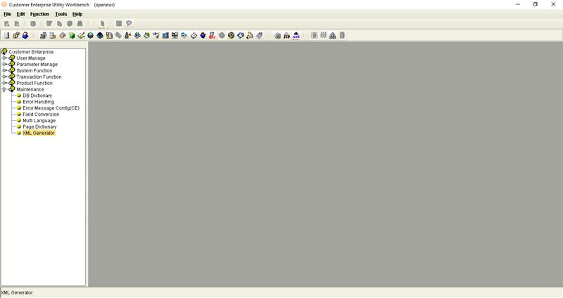 |
|                                                                                                                                                                                                                                                                                                                                                                                                                                                                                                                                                          |      |                                                               |
| The XML Generator function window is displayed\.  When there are newly defined or modified parameters, the Meta Data to XML window is also displayed\.  It lists these parameters for easy selection\.  In this case, the parameter can be selected from this window and the Apply button clicked\. Afterwards, proceed to Step 5\.  Alternatively, the Meta data or parameter can be manually selected from the main XML Generator window\.  In this case, click on the Close button of the Meta Data to XML window and proceed to Step 4\. |      |  |
|                                                                                                                                                                                                                                                                                                                                                                                                                                                                                                                                                          |      |                                                               |
| Double\-click on the relevant parameter type from the XML Generator window\.                                                                                                                                                                                                                                                                                                                                                                                                                                                                             |      |  |
|                                                                                                                                                                                                                                                                                                                                                                                                                                                                                                                                                          |      |                                                               |
| Depending on the selected parameter type, an XML configuration window may be displayed\. In other cases, the process directly proceeds to Step 6\.  If the configuration window is displayed, indicate the exact or any additional setting required to generate the relevant XML files\. When the specifications are defined click on the Save button                                                                                                                                                                                              |      | 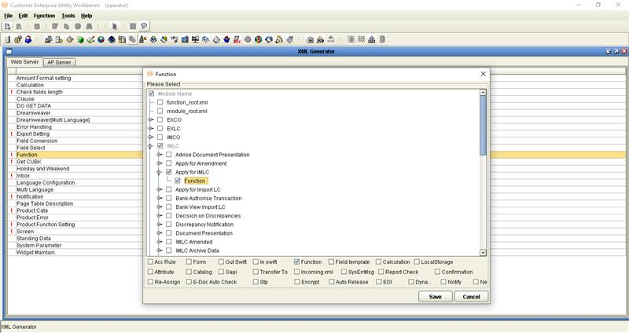 |
|                                                                                                                                                                                                                                                                                                                                                                                                                                                                                                                                                          |      |                                                               |
| A message is displayed confirming if the XML files are to be generated on the system path\.                                                                                                                                                                                                                                                                                                                                                                                                                                                              |      |  |
|                                                                                                                                                                                                                                                                                                                                                                                                                                                                                                                                                          |      |                                                               |
| <u>**NOTE**</u>:  The path of the XML files is defined through the GEN\_XML\_ROOTPATH Utility Workbench system parameter\. This system parameter is configured through the System Parameter function from the Parameter Manage function group\.                                                                                                                                                                                           |      |  |
|                                                                                                                                                                                                                                                                                                                                                                                                                                                                                                                                                          |      |                                                               |
| To save the XML file on the relevant system path, click on the Yes button\.  To specify another path, click on the No button\. On the Save dialog box that is displayed, browse for the path and click on the Save button\.                                                                                                                                                                                                                                                                                                                        |      |  |
|                                                                                                                                                                                                                                                                                                                                                                                                                                                                                                                                                          |      |                                                               |
| When the relevant XML files are generated, the system displays a confirmation message\.    <u>**NOTE**</u>:  To hide the information on the paths of the generated XML files, click on the Hide button\.                                                                                                                                                                                                                      |      |  |
|                                                                                                                                                                                                                                                                                                                                                                                                                                                                                                                                                          |      |                                                               |
| <u>**NOTE**</u>:  Check the indicated path\(s\) to see the generated XML files\.                                                                                                                                                                                                                                                                                                                                                          |      |  |

Building a Product

When building a product in the CE Utility, a few prerequisites are required to be met to make sure that modules or products are built in accordance with the bank's requirements\.  One step is the GAP analysis which involves an evaluation of transaction requirements, based on the process flow \(e\.g\., fields, clauses, forms, and interfaces\)\.  These are necessary for identifying the fields required for anticipating the required output\.  When the analysis has been completed, the project team can now begin the process of building a product for the bank's customers\.

The following are steps in building a product:

**Access the CE Utility**\.  To access the CE Utility for building parameters, an Operator user must be created by an Administrator user\.  This is set up through the User Manager function in the User Manage function group\.

**Set up the module and events**\.  This involves naming the module and the projected events that manage the transaction flow within the module\.  This is set up in the Module and Event function in CE Utility\.

**Set up the transaction tables\.** This involves creating the tables in the DB Dictionary function in CE Utility\.  There can be different types of tables but only three are mandatory for a CE module: master, ledger, and event\. 

NOTE: **It is possible to create tables directly into the database by running SQL scripts in the database\.  In this case, tables can be created before modules and events\.  It is recommended, however, to use the DB Dictionary for creating tables\.**

**Add fields to the transaction table**\.  Fields must be added to a transaction table and field properties defined for the processing and storage of data\.  These can be done through the DB Dictionary function in CE Utility\.

**Set up the transaction functions**\.  This involves creating the functions that correspond to actual business transaction processes\.  This is done through Transaction Function in the Transaction Function group\.

**Set up the transaction parameters**\.  This involves designing the transaction screen, defining attribute and catalog settings, and attaching these parameters to the transaction function\.  These can be done through Transaction Function in CE Utility\.

**Create the product\.** The product is the actual functionality accessed and run by the end\-user\.  This process of creating a product involves setting up the product group, product, and product function, and defining product catalog settings\.

**Define authorization rules**\.  Authorization rules are set to further define or set limits for authorizing transactions\. 

**Calculation\.** This involves configuring the transaction JS files and defining calculation functions using available system methods\.  There are three JS files that have to be configured: the Module Base JS file, Event JS file, and Function JS file\.

**Define the settings for the transaction input\.** Certain functions may be added to aid in the input of data into the transaction\.  The CE Utility provides options for setting up field conversion rules, lookup buttons, customer reference numbers, clauses, dropdown lists, and data objects for this purpose\.

**Define the settings for the transaction output\.** Some business transactions involve output generation \(i\.e\., Forms\)\.  To make this option available, certain settings must be configured using the functions from the Transaction Function group in CE Utility\. 

**Define the security settings in the CE browser\.** The products and functions created are assigned to an end\-user through the browser\-side Security and System Maintenance functions\.

NOTE: **The browser\-side security and system maintenance functions of CE are often collectively called the Security Module\.**

**Add the Inbox functionality\.** Another way of accessing a product or a transaction for further processing is through the Customer Inbox\.  This can be set up through the Inbox function in CE Utility\.

NOTE: **For more information on configuring different parameters in CE, refer to the** ***CE Utility Reference*** **manuals*****\.***

Archiving Prerequisites

Archiving / BACKUP Database Settings

Data Source Settings

Log Settings

Archiving / Backup Database Settings

Transaction records are archived into a separate Backup Database, i\.e\., the archiving database\.  

This Backup Database must have the same table structure as the physical Transaction Database\.  When the table structures of the Transaction Database is changed, modify the corresponding table structures in the Backup Database by manually running the relevant SQL statements in this archiving database\.

**NOTE:** The Backup Database settings must be configured in the same application server \(WAS\)\.

Data Source Settings

For the Archiving and Recovery functionality of the CE system, two data sources are required: CEB and CEX\.

The CEB data source refers to the Backup data source and, thus, points to the physical archiving database\. Used for storing archived data, this Backup Database has the same table structure as the Transaction Database\.

The CEX data source points to the physical Transaction Database, and is essentially the same as the CET data source\.

The settings for the CEB and CEX data sources are configured in both WebSphere and CE Utility\.

WebSphere Data Source Settings

The required WebSphere settings are as follows\.

| **Do the following \. \. \.** |
| ---------------------------------------------------------------- |

| Define the JDBC provider:  Name: Oracle JDBC Driver \(XA\)  Implementation class name: oracle\.jdbc\.xa\.client\.OracleXADataSource  Class path: $\{ORACLE\_JDBC\_DRIVER\_PATH\}/ojdbc6\.jar    <u>**NOTE:**</u>  The ojdbc6\.jar file is the JDBC driver for Oracle 12c\.                                                                                                                                                                                                                                                                                                                                                                                                                                                            |      |                                                                       |
| ------------------------------------------------------------------------------------------------------------------------------------------------------------------------------------------------------------------------------------------------------------------------------------------------------------------------------------------------------------------------------------------------------------------------------------------------------------------------------------------------------------------------------------------------------------------------------------------------------------------------------------------------------------------------------------------------------------------------------------------------------------------------------------------------------------------------------------------------------------------------------------------------------------------------------------------------------------------------------------------- | :--: | :--------------------------------------------------------------------------------------------------------------------------------: |
|                                                                                                                                                                                                                                                                                                                                                                                                                                                                                                                                                                                                                                                                                                                                                                                                                                                                                                                                                                                             |      |                                                                                                                                    |
| Define the CEB data source:  Name: CEB  JNDI Name: CEB                                                                                                                                                                                                                                                                                                                                                                                                                                                                                                                                                                                                                                                                                                                                                                                                                                                                                                                          |      | 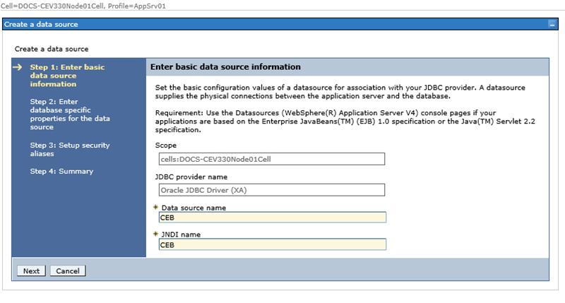                                                                      |
|                                                                                                                                                                                                                                                                                                                                                                                                                                                                                                                                                                                                                                                                                                                                                                                                                                                                                                                                                                                             |      |                                                                                                                                    |
| This must point to the Backup Database \(e\.g\., CEBK\)\.  Assign CETRX for:  Authentication alias for XA recovery  Component\-managed authentication alias  Container\-managed authentication alias    <u>**NOTE:**</u>  The CETRX user created in the Oracle Database is the user that is to access the Backup Database\. If this is not the same as the transaction database user, the CETRX alias must be set in the Global Security tab, JAAS \- J2C Authentication Data page of the WebSphere Application Server Administrative Console\.  |      |    |
|                                                                                                                                                                                                                                                                                                                                                                                                                                                                                                                                                                                                                                                                                                                                                                                                                                                                                                                                                                                             |      |                                                                                                                                    |
| Define the CEX data source:  Name: CEX  JNDI Name: CEX                                                                                                                                                                                                                                                                                                                                                                                                                                                                                                                                                                                                                                                                                                                                                                                                                                                                                                                          |      |                                                                       |
|                                                                                                                                                                                                                                                                                                                                                                                                                                                                                                                                                                                                                                                                                                                                                                                                                                                                                                                                                                                             |      |                                                                                                                                    |
| This must point to the Transaction Database \(e\.g\., CEDB\)\.  Assign CETRX for:  Authentication alias for XA recovery  Component\-managed authentication alias  Container\-managed authentication alias    <u>**NOTE:**</u>  The CETRX user is the same as the CETRX user that is used to access the transaction database\.  The CEX data source points to the physical Transaction Database, and is essentially the same as the CET data source\.                                                                                                                                                                                                                                                                                                         |      |    |

CE Utility Data Source Settings

Log on the CE Utility as a Super Administrator user and configure the following data source settings\.

| **Do the following \. \. \.** |
| ---------------------------------------------------------------- |

| Run the DataSource Manage function from the User Manage group\.                                                                                                                                                                                                                                                                                                                                                                                                                                                                                                                                          |      |  |
| -------------------------------------------------------------------------------------------------------------------------------------------------------------------------------------------------------------------------------------------------------------------------------------------------------------------------------------------------------------------------------------------------------------------------------------------------------------------------------------------------------------------------------------------------------------------------------------------------------- | ---- | ------------------------------------------------------------- |
|                                                                                                                                                                                                                                                                                                                                                                                                                                                                                                                                                                                                          |      |                                                               |
| Check the settings in the Transaction Data Source Manager tab of the DataSource Manage function window\.                                                                                                                                                                                                                                                                                                                                                                                                                                                                                                 |      | 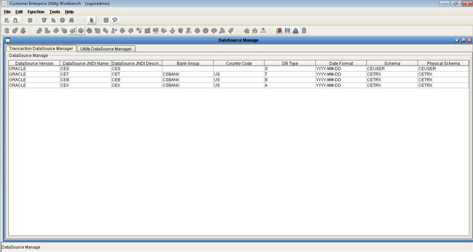 |
|                                                                                                                                                                                                                                                                                                                                                                                                                                                                                                                                                                                                          |      |                                                               |
| Modify or create the CEX data source\.  This data source must point to the Transaction Database, and reference the CEX JNDI setting and CETRX user profile\.  Make sure to select Archiving as the database type\.                                                                                                                                                                                                                                                                                                                                                                           |      |  |
|                                                                                                                                                                                                                                                                                                                                                                                                                                                                                                                                                                                                          |      |                                                               |
| Modify or create the CEB data source\.  This data source must point to the Backup Database, and reference the CEB JNDI setting and CETRX user profile\.   Make sure to select Backup as the database type\.    <u>**NOTE:**</u>  CETRX is the CE Transaction Database user that is to access the Backup Database\.                                                                                                                                                                                   |      |  |
|                                                                                                                                                                                                                                                                                                                                                                                                                                                                                                                                                                                                          |      |                                                               |
| <u>**XML GENERATION:**</u>  Log on as an Administrator or Operator user and run the XML Generator function\.  Generate the XML file for the Data Source Manager parameter\.                                                                                                                                                                                                                                   |      |  |
|                                                                                                                                                                                                                                                                                                                                                                                                                                                                                                                                                                                                          |      |                                                               |
| The updated XML files are generated on this path:  \[Parameter Drive\]\CE\_SYS\SYST  The updated ee\_dsmgr\.xml file contains details on the bank groups which data sources have been set\. |      |  |

Log Settings

Configure the settings for the Archive logs through this file:

\[CE Parameter Folder\]\CE\_SYS\CE\_Log\_Config\.xml

<u>**EXAMPLE:**</u>

Archive Log configuration settings:

For detailed information on log configuration, refer to the *CE Log Settings* documentation\.

Manual Archive Mode

Overview

COMMON pARAMETER Settings

ARCHIVE DATA FUNCTION

Restore Archived Data Function

Inquire Archived Data function

Overview

With the Manual Archive mode, the archiving process is performed by module\. The archiving functions are grouped and accessed under a particular transaction module\. Moreover, only the records that satisfy the defined set of criteria can be accessed and processed under an Archive function\.

The Manual Archive functions that may be created under a business transaction module are as follows:

Archiving Data

Inquire Archived Data

Restore Archived Data

Common Parameter Settings

Configuring manual Archiving functions involves common prerequisite parameters\.

Archive Control Component

Trx Manager Archive, a Control component, is used for 2 manual Archiving functions: Archive Data and Restore Archived Data\.

Log on the CE Utility as an Operator user and define the following settings\.

| Do the following \. \. \. |
| :------------------------ |

| Run the Component Manage function from the Parameter Manage function group\.                                                                                                                                                      |      |  |
| --------------------------------------------------------------------------------------------------------------------------------------------------------------------------------------------------------------------------------- | ---- | :-----------------------------------------------------------: |
|                                                                                                                                                                                                                                   |      |                                                               |
| Access the Control component type\.                                                                                                                                                                                               |      |  |
|                                                                                                                                                                                                                                   |      |                                                               |
| Check or add the Trx Manager Archive Control component:  Component Name: Trx Manager Archive  Component Description: Trx Manager Archive  Class Name: TrxManagerArchive  Business Type: Delete Master Mgr |      |  |

Archive Product Items

Specific Archive product items are required to associate a manual Archiving function to the relevant Archiving product\.

Add the following product items \- 

Archive

RestoreArchive

InquireArchive

\- to this file:

\[CE Utility Directory\]\ce\_params\Script\_XML\product\_item\_prar\.xml\.

|  |
| ------------------------------------------------------------- |

Figure 4\.  Product Items for Archiving

Once these product Ids are defined in the XML file, add these in the Product Item function\.  Log on the CE Utility as an Operator user:

| Do the following \. \. \. |
| :------------------------ |

| Run the Product Item function from the Product Function group\.                                                                                                                                                                                               |      |  |
| ------------------------------------------------------------------------------------------------------------------------------------------------------------------------------------------------------------------------------------------------------------- | ---- | :-----------------------------------------------------------: |
|                                                                                                                                                                                                                                                               |      |                                                               |
| Add the Archive item Id:  Item ID: Archive  Item Name: Archive  Item Desc: Archive  Is Group: No  Position: Transaction  Item Button: Archive  Type: Delete                                                         |      |  |
|                                                                                                                                                                                                                                                               |      |                                                               |
| Add the RestoreArchive item Id:     Item ID: RestoreArchive     Item Name: RestoreArchive     Item Desc: RestoreArchive     Is Group: No     Position: Transaction     Item Button: RestoreArchive     Type: Delete |      |  |
|                                                                                                                                                                                                                                                               |      |                                                               |
| Add the InquireArchive item Id:  Item ID: InquireArchive  Item Name: InquireArchive  Item Desc: InquireArchive  Is Group: No  Position: Transaction  Item Button: InquireArchive  Type: Inquire                     |      |  |

Error Codes

Log on the CE Utility as an Operator user and define the following error codes for Archiving processes\.

| Do the following \. \. \. |
| :------------------------ |

| Run the Error Handling function from the Maintenance function group\.                                                                                                      |      |  |
| -------------------------------------------------------------------------------------------------------------------------------------------------------------------------- | ---- | :-----------------------------------------------------------: |
|                                                                                                                                                                            |      |                                                               |
| In the Catalog tab of the Error Handling function window, access the System node\.                                                                                         |      |  |
|                                                                                                                                                                            |      |                                                               |
| Check or add Error Code 000464:  Error Code: 000464  Error Key: System  Error Level: Error  Error Messge: "Archive failure"                        |      |  |
|                                                                                                                                                                            |      |                                                               |
| Check or add Error Code 000465:  Error Code: 000465  Error Key: System  Error Level: Error  Error Messge: "Exception occur when restoring Archive" |      |  |

JSP and JS Settings

Modify the JSP and JS settings of the relevant transaction module to support the Archiving and Recovery functionality\.

Examples of such settings are provided in [Appendix:](<error reading>) \.

Archive Data Function

This function is used for archiving records\.  

NOTE: 

**Archived records are stored in the Backup Database\.  An archived transaction can be restored through the Restore Archived Data function\.**

**Multiple records can be archived at a time** **by adding** **the** **following** **code** **in the** **multiCheck** **function** **found** **in the** **SYS\_MultiCatalog\.js** **file:**   **:: ITEM\_ID == "Archive" :: ITEM\_ID == "RestoreArchive"\)**

**Example****:**

**function multiCheck\(\)\{**

 **try \{**

    **if \(ITEM\_ID == "Authorize" :: ITEM\_ID == "Authorise"** :: **ITEM\_ID == "Archive" :: ITEM\_ID == "RestoreArchive"\)** **\{**

    **return true;**

 **\}**

 **\}** 

 **catch \(e\) \{**

 **showExcpt\("SYS\_MultiCatalog", e\);**

 **\}**

**\}**

Parameter Settings

Log on CE Utility as an Operator user and configure the following transaction function and product settings\.

Transaction Function Settings

| Do the following \. \. \. |
| :------------------------ |

| Run Transaction Function from the Transaction Function group\.                                                                                                                                                                                                                                                                                                                                                                                                                                                                                                                                         |      | 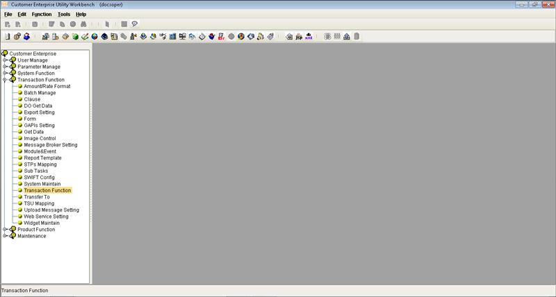 |
| ------------------------------------------------------------------------------------------------------------------------------------------------------------------------------------------------------------------------------------------------------------------------------------------------------------------------------------------------------------------------------------------------------------------------------------------------------------------------------------------------------------------------------------------------------------------------------------------------------ | ---- | :-----------------------------------------------------------: |
|                                                                                                                                                                                                                                                                                                                                                                                                                                                                                                                                                                                                        |      |                                                               |
| Access the module and function group for which the Archive Data function is to be created\.    <u>**EXAMPLE:**</u>  Module: Import Letters of Credit  Function Group: System Maintenance\.                                                                                                                                                                                                                                                                            |      | 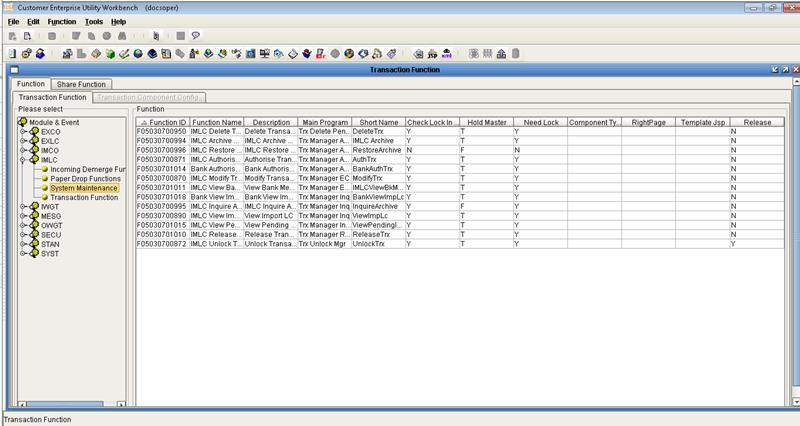 |
|                                                                                                                                                                                                                                                                                                                                                                                                                                                                                                                                                                                                        |      |                                                               |
| Create the Archive Data function and set its main program to Trx Manager Archive\.    <u>**EXAMPLE:**</u>  Function: IMLC Archive Data    <u>**NOTE:**</u>  Unmark the following flags:  Check for Lock in Master  Hold Master  Need Lock  Release |      |  |
|                                                                                                                                                                                                                                                                                                                                                                                                                                                                                                                                                                                                        |      |                                                               |
| Define the relevant Attribute settings for this function\.                                                                                                                                                                                                                                                                                                                                                                                                                                                                                                                                             |      |  |
|                                                                                                                                                                                                                                                                                                                                                                                                                                                                                                                                                                                                        |      |                                                               |
| Define the relevant Catalog settings for this function\.                                                                                                                                                                                                                                                                                                                                                                                                                                                                                                                                               |      |  |
|                                                                                                                                                                                                                                                                                                                                                                                                                                                                                                                                                                                                        |      |                                                               |
| <u>**NOTE**</u><u>**:**</u>  If this manual Archive function is to be used to archive a record that has been received via STP, the STP settings must also be configured through the STP function component\.  For details on STP Archive functions, refer to:  Chapter Six: Archiving through STP                                                                  |      |  |

Product Settings

| Do the following \. \. \. |
| :------------------------ |

| Access the Product Function Setting function from the Product Function group\.                                                                                                                                                                                                                  |      |  |
| ----------------------------------------------------------------------------------------------------------------------------------------------------------------------------------------------------------------------------------------------------------------------------------------------- | ---- | :-----------------------------------------------------------: |
|                                                                                                                                                                                                                                                                                                 |      |                                                               |
| Access the relevant product group and product from the Product Function tab\.    <u>**EXAMPLE:**</u>  Product Group: Import  Product: Import Letters of Credit |      |  |
|                                                                                                                                                                                                                                                                                                 |      |                                                               |
| Select the Archive Data function \(e\.g\., IMLC Archive Data\) and assign these settings:  Item: Archive  Item Type: Delete                                                                                                                                                         |      |  |

Transaction Process

| EXAMPLE |
| :------ |

| IMLC Archive Data Function  Run the IMLC Archive Data function\.                                                                                                                                                                                                            |      |  |
| --------------------------------------------------------------------------------------------------------------------------------------------------------------------------------------------------------------------------------------------------------------------------------- | ---- | :----------------------------------------------------------------------: |
|                                                                                                                                                                                                                                                                                   |      |                                                                          |
| Select one record and click on the Archive button\.  Check the Archive Log: All transaction event records \- and related data including images, documents, mails, GAPI, etc\. \- are archived into the Backup Database and deleted from the original Transaction Database\. |      |  |
|                                                                                                                                                                                                                                                                                   |      |                                                                          |
| IMLC Inquire Archive Function  Run the IMLC Inquire Archive function\.   The catalog shows the archived record\.  Select this record and click on the InquireArchive button\.                                                                                         |      |  |
|                                                                                                                                                                                                                                                                                   |      |                                                                          |
| The documents and uploaded images for this record are listed for viewing \(through the corresponding View buttons\)\.                                                                                                                                                             |      |  |
|                                                                                                                                                                                                                                                                                   |      |                                                                          |
| Click on the View Historical button\.                                                                                                                                                                                                                                             |      |  |
|                                                                                                                                                                                                                                                                                   |      |                                                                          |
| The events of the transaction record are listed\.                                                                                                                                                                                                                                 |      |  |
|                                                                                                                                                                                                                                                                                   |      |                                                                          |
| Select an event to view the event details\.                                                                                                                                                                                                                                       |      |  |

Restore Archived Data Function

This function is used to retrieve transactions from the Backup Database, and add these back to the master file\.

When the record to be restored already exists in the Transaction Database, the Restore process may not be performed on this record\.

When a record is restored, all related events are also restored in the corresponding tables\.

NOTE: 

**M****ultiple records** **may be restored by adding the following code in the** **multiCheck** **function** **found** **in the** **SYS\_MultiCatalog\.js** **file:**  **:: ITEM\_ID == "Archive" :: ITEM\_ID == "RestoreArchive"\)**

<u>EXAMPLE:</u>

**function multiCheck\(\)\{**

 **try \{**

    **if \(ITEM\_ID == "Authorize" :: ITEM\_ID == "Authorise"** :: **ITEM\_ID == "Archive" :: ITEM\_ID == "RestoreArchive"\)** **\{**

    **return true;**

 **\}**

 **\}** 

 **catch \(e\) \{**

 **showExcpt\("SYS\_MultiCatalog", e\);**

 **\}**

**\}**

**The system restores multiple r****ecords one at a time\.** **After restoring the first selected record****, the system provides a Continue button to** **enable the user to** **restore the next selected records\.**  

Parameter Settings

Log on CE Utility as an Operator user and configure the following transaction function and product settings\.

Transaction Function Settings

| Do the following \. \. \. |
| :------------------------ |

| Run Transaction Function from the Transaction Function group\.                                                                                                                                                                                                                                                                                                                                                                                                                                                                                                                                                     |      |  |
| ------------------------------------------------------------------------------------------------------------------------------------------------------------------------------------------------------------------------------------------------------------------------------------------------------------------------------------------------------------------------------------------------------------------------------------------------------------------------------------------------------------------------------------------------------------------------------------------------------------------ | ---- | :-----------------------------------------------------------: |
|                                                                                                                                                                                                                                                                                                                                                                                                                                                                                                                                                                                                                    |      |                                                               |
| Access the module and function group for which the Restore Archived Data function is to be created\.    <u>**EXAMPLE:**</u>  Module: Import Letters of Credit  Function Group: System Maintenance\.                                                                                                                                                                                                                                                                               |      |  |
|                                                                                                                                                                                                                                                                                                                                                                                                                                                                                                                                                                                                                    |      |                                                               |
| Create the Restore Archived Data function and set its main program to Trx Manager Archive\.    <u>**EXAMPLE:**</u>  Function: IMLC Restore Archive    <u>**NOTE:**</u>  Unmark the following flags:  Check for Lock in Master  Hold Master  Need Lock  Release |      |  |
|                                                                                                                                                                                                                                                                                                                                                                                                                                                                                                                                                                                                                    |      |                                                               |
| Define the relevant Catalog settings for this function\.                                                                                                                                                                                                                                                                                                                                                                                                                                                                                                                                                           |      |  |

Product Settings

| Do the following \. \. \. |
| :------------------------ |

| Access the Product Function Setting function from the Product Function group\.                                                                                                                                                                                                                  |      |  |
| ----------------------------------------------------------------------------------------------------------------------------------------------------------------------------------------------------------------------------------------------------------------------------------------------- | ---- | :-----------------------------------------------------------: |
|                                                                                                                                                                                                                                                                                                 |      |                                                               |
| Access the relevant product group and product from the Product Function tab\.    <u>**EXAMPLE:**</u>  Product Group: Import  Product: Import Letters of Credit |      |  |
|                                                                                                                                                                                                                                                                                                 |      |                                                               |
| Select the Restore Archived Data function \(e\.g\., IMLC Restore Archive\) and assign these settings:  Item: RestoreArchive  Item Type: Delete                                                                                                                                      |      |  |

Transaction Process

-----

**Table has a different set of cells in one/more rows. It can't be shown in Markdown**

-----

Inquire Archived Data Function

The Inquire Archived Data function is used to inquire into records that are stored in the Archive file\.

NOTE: **Unlike other** **inquiry** **functions, the Inquire Archived Data function retrieves** **details** **from the Backup Database \(i\.e\., CEB data source\) and not from the Transaction Database\.**

Parameter Settings

Log on CE Utility as an Operator user and configure the following transaction function and product settings\.

Transaction Function Settings

| Do the following \. \. \. |
| :------------------------ |

| Run Transaction Function from the Transaction Function group\.                                                                                                                                                                                                                                                     |      |  |
| ------------------------------------------------------------------------------------------------------------------------------------------------------------------------------------------------------------------------------------------------------------------------------------------------------------------ | ---- | :-----------------------------------------------------------: |
|                                                                                                                                                                                                                                                                                                                    |      |                                                               |
| Access the module and function group for which the Archive Data is to be created\.    <u>**EXAMPLE:**</u>  Module: Import Letters of Credit  Function Group: System Maintenance\. |      |  |
|                                                                                                                                                                                                                                                                                                                    |      |                                                               |
| Create the Inquire Archived Data function and set its main program to Trx Manager Inq\.    <u>**EXAMPLE:**</u>  Function: IMLC Inquire Archive                                                                             |      |  |
|                                                                                                                                                                                                                                                                                                                    |      |                                                               |
| Attach the transaction JSP and template JSP files to this function\.                                                                                                                                                                                                                                               |      |  |
|                                                                                                                                                                                                                                                                                                                    |      |                                                               |
| Define the relevant Attribute settings for this function\.                                                                                                                                                                                                                                                         |      |  |
|                                                                                                                                                                                                                                                                                                                    |      |                                                               |
| Define the relevant Catalog settings for this function\.                                                                                                                                                                                                                                                           |      |  |

Product Settings

| Do the following \. \. \. |
| :------------------------ |

| Access the Product Function Setting function from the Product Function group\.                                                                                                                                                                                                                  |      |  |
| ----------------------------------------------------------------------------------------------------------------------------------------------------------------------------------------------------------------------------------------------------------------------------------------------- | ---- | :-----------------------------------------------------------: |
|                                                                                                                                                                                                                                                                                                 |      |                                                               |
| Access the relevant product group and product from the Product Function tab\.    <u>**EXAMPLE:**</u>  Product Group: Import  Product: Import Letters of Credit |      |  |
|                                                                                                                                                                                                                                                                                                 |      |                                                               |
| Select the Inquire Archived Data function \(e\.g\., IMLC Inquire Archive\) and assign these settings:  Item: InquireArchive  Item Type: Inquire                                                                                                                                     |      |  |

Transaction Process

| EXAMPLE |
| :------ |

| Through the IMLC Archive Data function, archive one record\.                                                                                         |      |  |
| ---------------------------------------------------------------------------------------------------------------------------------------------------- | ---- | :----------------------------------------------------------------------: |
|                                                                                                                                                      |      |                                                                          |
| Run the IMLC Inquire Archive function\.   The catalog shows the archived record\.  Select this record and click on the InquireArchive button\. |      |  |
|                                                                                                                                                      |      |                                                                          |
| The documents and uploaded images for this record are listed for viewing \(through the corresponding View buttons\)\.                                |      |  |
|                                                                                                                                                      |      |                                                                          |
| Click on the View Historical button\.                                                                                                                |      |  |
|                                                                                                                                                      |      |                                                                          |
| The events of the transaction record are listed\.                                                                                                    |      |  |
|                                                                                                                                                      |      |                                                                          |
| Select an event to view the event details\.                                                                                                          |      |  |

Auto Archive Mode

Overview

parameter SEttings

Transaction Process

Overview

With the Auto Archive mode \(or batch mode\), records from the relevant module that satisfy a defined set of criteria for the module are automatically archived\.  

The AutoArchiveData batch function is an example of an Auto Archive function\.

NOTE: **Each module has its own Archive conditions, which are set through the** **Sub Task function** **of the CE Utility\.**  **Refer to the** **succeeding** **[Par](<error reading>)** **section for more** **details** **on setting the archive conditions for each module\.**

 

Parameter Settings

One of the tasks under the AutoProcessTaskMgr batch manager, the AutoArchiveData batch function is used to automatically archive transaction records from a particular module that satisfy a defined set of criteria\.

The parameter settings for this batch function involve settings in the Sub Tasks, AP Server, Import/Export Business Unit, and Batch Manage functions\.  Log on the CE Utility as an Operator user and configure the following settings\.

| Do the following \. \. \. |
| :------------------------ |

| Sub Tasks  Run the Sub Tasks function from the Transaction Function group\.                                                                                                                                                                                                                                                                                                                                                                                                                                                                                                                                                                                                                                                                                                                                                                                                                                                                                                                                                                                                                                                                                                                                                                                                                                                                                                                                                                                                                                                                                                             |      |      |
| --------------------------------------------------------------------------------------------------------------------------------------------------------------------------------------------------------------------------------------------------------------------------------------------------------------------------------------------------------------------------------------------------------------------------------------------------------------------------------------------------------------------------------------------------------------------------------------------------------------------------------------------------------------------------------------------------------------------------------------------------------------------------------------------------------------------------------------------------------------------------------------------------------------------------------------------------------------------------------------------------------------------------------------------------------------------------------------------------------------------------------------------------------------------------------------------------------------------------------------------------------------------------------------------------------------------------------------------------------------------------------------------------------------------------------------------------------------------------------------------------------------------------------------------------------------------------------------------- | ---- | :----------------------------------------------------------------------------: |
|                                                                                                                                                                                                                                                                                                                                                                                                                                                                                                                                                                                                                                                                                                                                                                                                                                                                                                                                                                                                                                                                                                                                                                                                                                                                                                                                                                                                                                                                                                                                                                                               |      |                                                                                |
| Access the Auto Process Manage subtask type\.                                                                                                                                                                                                                                                                                                                                                                                                                                                                                                                                                                                                                                                                                                                                                                                                                                                                                                                                                                                                                                                                                                                                                                                                                                                                                                                                                                                                                                                                                                                                                 |      |      |
|                                                                                                                                                                                                                                                                                                                                                                                                                                                                                                                                                                                                                                                                                                                                                                                                                                                                                                                                                                                                                                                                                                                                                                                                                                                                                                                                                                                                                                                                                                                                                                                               |      |                                                                                |
| Configure the AutoArchiveData settings as required, and make sure to define the following:  Task Name, Task Description, Task Component: AutoArchiveData  Start Schedule Type and related settings    <u>**NOTE:**</u>  The Month, Week Day, Day, and Hour fields are enabled based the Start Schedule Type field setting\. Define the values of these fields as well as the Minute component of the archive task schedule accordingly\. Refer to the *CE Utility Referenc**e**:* *Transaction Functions* documentation for more details on these settings\.  Marking the Start Server flag allows a user to manually start the AutoArchiveData task\.  The Timer \(Hours\) field pertains to the duration within which the system archives the records that meet the criteria\.  If the records are not archived completely within this period, the system terminates the archive process\.  |      |      |
|                                                                                                                                                                                                                                                                                                                                                                                                                                                                                                                                                                                                                                                                                                                                                                                                                                                                                                                                                                                                                                                                                                                                                                                                                                                                                                                                                                                                                                                                                                                                                                                               |      |                                                                                |
| AP Server  Run the AP Server function from the Parameter Manage function group\.                                                                                                                                                                                                                                                                                                                                                                                                                                                                                                                                                                                                                                                                                                                                                                                                                                                                                                                                                                                                                                                                                                                                                                                                                                                                                                                                                                                                                                                                                                        |      |  |
|                                                                                                                                                                                                                                                                                                                                                                                                                                                                                                                                                                                                                                                                                                                                                                                                                                                                                                                                                                                                                                                                                                                                                                                                                                                                                                                                                                                                                                                                                                                                                                                               |      |                                                                                |
| Define or modify the AP Server settings: Name, Host Name, and IIOP Port\.                                                                                                                                                                                                                                                                                                                                                                                                                                                                                                                                                                                                                                                                                                                                                                                                                                                                                                                                                                                                                                                                                                                                                                                                                                                                                                                                                                                                                                                                                                                     |      | 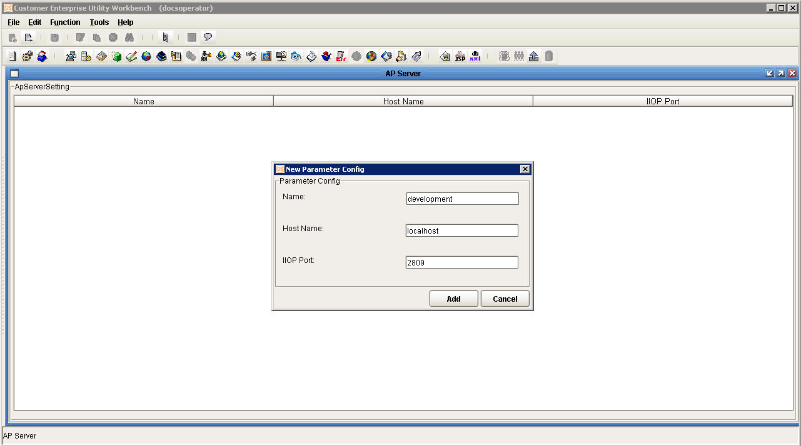 |
|                                                                                                                                                                                                                                                                                                                                                                                                                                                                                                                                                                                                                                                                                                                                                                                                                                                                                                                                                                                                                                                                                                                                                                                                                                                                                                                                                                                                                                                                                                                                                                                               |      |                                                                                |
| Import/Export Business Unit  Run the Import/Export Business Unit function from the User Manager function group\.                                                                                                                                                                                                                                                                                                                                                                                                                                                                                                                                                                                                                                                                                                                                                                                                                                                                                                                                                                                                                                                                                                                                                                                                                                                                                                                                                                                                                                                                        |      |  |
|                                                                                                                                                                                                                                                                                                                                                                                                                                                                                                                                                                                                                                                                                                                                                                                                                                                                                                                                                                                                                                                                                                                                                                                                                                                                                                                                                                                                                                                                                                                                                                                               |      |                                                                                |
| In the Import/Export Business Unit window, select the Application Server setting and click on the Import button\.                                                                                                                                                                                                                                                                                                                                                                                                                                                                                                                                                                                                                                                                                                                                                                                                                                                                                                                                                                                                                                                                                                                                                                                                                                                                                                                                                                                                                                                                             |      |  |
|                                                                                                                                                                                                                                                                                                                                                                                                                                                                                                                                                                                                                                                                                                                                                                                                                                                                                                                                                                                                                                                                                                                                                                                                                                                                                                                                                                                                                                                                                                                                                                                               |      |                                                                                |
| Batch Manage  Run the Batch Manage function from the Transaction Function group\.                                                                                                                                                                                                                                                                                                                                                                                                                                                                                                                                                                                                                                                                                                                                                                                                                                                                                                                                                                                                                                                                                                                                                                                                                                                                                                                                                                                                                                                                                                       |      |      |
|                                                                                                                                                                                                                                                                                                                                                                                                                                                                                                                                                                                                                                                                                                                                                                                                                                                                                                                                                                                                                                                                                                                                                                                                                                                                                                                                                                                                                                                                                                                                                                                               |      |                                                                                |
| Create or modify the AutoProcessTaskMgr batch manager\. Select the correct AP Server Name setting\.                                                                                                                                                                                                                                                                                                                                                                                                                                                                                                                                                                                                                                                                                                                                                                                                                                                                                                                                                                                                                                                                                                                                                                                                                                                                                                                                                                                                                                                                                           |      |  |
|                                                                                                                                                                                                                                                                                                                                                                                                                                                                                                                                                                                                                                                                                                                                                                                                                                                                                                                                                                                                                                                                                                                                                                                                                                                                                                                                                                                                                                                                                                                                                                                               |      |                                                                                |
| Add AutoArchiveData as a subtask of the AutoProcessTaskMgr batch manager\.                                                                                                                                                                                                                                                                                                                                                                                                                                                                                                                                                                                                                                                                                                                                                                                                                                                                                                                                                                                                                                                                                                                                                                                                                                                                                                                                                                                                                                                                                                                    |      |      |
|                                                                                                                                                                                                                                                                                                                                                                                                                                                                                                                                                                                                                                                                                                                                                                                                                                                                                                                                                                                                                                                                                                                                                                                                                                                                                                                                                                                                                                                                                                                                                                                               |      |                                                                                |
| Sub Tasks  Run the Sub Tasks function from the Transaction Function group\.  Access the Archiving subtask type\.                                                                                                                                                                                                                                                                                                                                                                                                                                                                                                                                                                                                                                                                                                                                                                                                                                                                                                                                                                                                                                                                                                                                                                                                                                                                                                                                                                                                                                                                  |      |      |
|                                                                                                                                                                                                                                                                                                                                                                                                                                                                                                                                                                                                                                                                                                                                                                                                                                                                                                                                                                                                                                                                                                                                                                                                                                                                                                                                                                                                                                                                                                                                                                                               |      |                                                                                |
| Access the relevant module and define the following settings\.                                                                                                                                                                                                                                                                                                                                                                                                                                                                                                                                                                                                                                                                                                                                                                                                                                                                                                                                                                                                                                                                                                                                                                                                                                                                                                                                                                                                                                                                                                                                |      |      |
|                                                                                                                                                                                                                                                                                                                                                                                                                                                                                                                                                                                                                                                                                                                                                                                                                                                                                                                                                                                                                                                                                                                                                                                                                                                                                                                                                                                                                                                                                                                                                                                               |      |                                                                                |

| Fields: Select PARENT\_MAIN\_REF   This reference number is used to identify the transaction and all its associated data \(e\.g\., images, documents\)\.                                                                                                                                                                                                                                                                                                                                                                                                                                                                                                                                                                                                                                                                                                                                          |      |      |
| ------------------------------------------------------------------------------------------------------------------------------------------------------------------------------------------------------------------------------------------------------------------------------------------------------------------------------------------------------------------------------------------------------------------------------------------------------------------------------------------------------------------------------------------------------------------------------------------------------------------------------------------------------------------------------------------------------------------------------------------------------------------------------------------------------------------------------------------------------------------------------------------------------- | ---- | :----------------------------------------------------------------------------: |
|                                                                                                                                                                                                                                                                                                                                                                                                                                                                                                                                                                                                                                                                                                                                                                                                                                                                                                         |      |                                                                                |
| In the text area, define the condition by which records from the module are archived\.    <u>**NOTE:**</u>  The SQL keywords \- such as SELECT and FROM \- must be in uppercase\.                                                                                                                                                                                                                                                                                                                                                                                                                                                                                   |      |      |
|                                                                                                                                                                                                                                                                                                                                                                                                                                                                                                                                                                                                                                                                                                                                                                                                                                                                                                         |      |                                                                                |
| <u>**XML GENERATION:**</u>  Generate the XML file for the Archive parameter\.                                                                                                                                                                                                                                                                                                                                                                                                                                                                                                                                                                                                                                                                         |      | 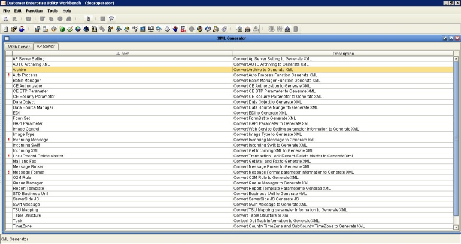     |
|                                                                                                                                                                                                                                                                                                                                                                                                                                                                                                                                                                                                                                                                                                                                                                                                                                                                                                         |      |                                                                                |
| Select all modules\.    <u>**NOTE:**</u>  Selecting all modules is recommended as the system generates XML only for the selected modules and deletes all previously generated XML for the unselected modules from the Archive folder under the CE\_SYS directory\. |      |  |
|                                                                                                                                                                                                                                                                                                                                                                                                                                                                                                                                                                                                                                                                                                                                                                                                                                                                                                         |      |                                                                                |
| The following files are generated in \[Parameter Drive\]\CE\_SYS\ARCHIVE:  autoporcess\.xml  module\_\[module short name\]\.xml  multiPending\.xml                                                                                                                                                                                                                                                                                                                                                                                                                                                                                                                                                     |      |  |

Transaction Process

| EXAMPLE: |
| :------- |

| Run the Batch Manager function and display the AutoProcessTaskMgr task manager\.  Start the AutoArchiveData subtask\.                                                                                                                                                                                                                                                                                                                               |      |  |
| --------------------------------------------------------------------------------------------------------------------------------------------------------------------------------------------------------------------------------------------------------------------------------------------------------------------------------------------------------------------------------------------------------------------------------------------------------- | ---- | :----------------------------------------------------------------------: |
|                                                                                                                                                                                                                                                                                                                                                                                                                                                           |      |                                                                          |
| Execute this SQL to check which records meet the archiving filter condition\.                                                                                                                                                                                                                                                                                                                                                                             |      |  |
|                                                                                                                                                                                                                                                                                                                                                                                                                                                           |      |                                                                          |
| Three records are archived according to the archiving period and archiving condition specified in the parameters\.  \(These pertain to the Auto Process Manage and Archiving settings defined in the Sub Tasks function\.\)  Check the Archive Log: All transaction event records \- and related data including images, documents, mails, GAPI, etc\. \- are archived into the Backup Database and deleted from the original Transaction Database\. |      |  |
|                                                                                                                                                                                                                                                                                                                                                                                                                                                           |      |                                                                          |
| Run the IMLC Inquire Archive function\.  The three records, along with their associated data, can be accessed through this function\.                                                                                                                                                                                                                                                                                                               |      |  |

Archiving through STP 

Overview

Parameter Settings

Transaction Process

Overview

When a record in the back\-office system is archived, the corresponding record in CE must also be archived\. 

The back\-office system sends the transaction's main reference number and other details to CE\.  CE, in turn, receives the data through Auto Process function and archives the relevant record through the STP Archive Data function\.  

NOTE: 

**The STP Archive Data and the** **manual** **Archive Data utilize the same** **f****unction, which main program is Trx Manager Archive\. For this function to** **perform** **the STP Archive Data process****,** **the** **STP and Attribute transaction component settings are defined****\.** 

**CE receives the** **STP message** **when the** **InGapiForm message broker** **is started\.**

  

Parameter Settings

Defining the STP configurations to archive transactions received via STP involves the following parameter settings:

Extension field

STP template and mapping rule

STP Archive Data function

Log on the CE Utility as an Operator user and configure the following settings\.

| Do the following \. \. \. |
| :------------------------ |

| Extension Field  Run the DB Dictionary function from the Maintenance function group\.                                                                                                                                                                                                                                                                                                                                                                                                                                                                                                                                                                                                                                                                                                                                          |      |  |
| ------------------------------------------------------------------------------------------------------------------------------------------------------------------------------------------------------------------------------------------------------------------------------------------------------------------------------------------------------------------------------------------------------------------------------------------------------------------------------------------------------------------------------------------------------------------------------------------------------------------------------------------------------------------------------------------------------------------------------------------------------------------------------------------------------------------------------------ | ---- | :------------------------------------------------------------------------: |
|                                                                                                                                                                                                                                                                                                                                                                                                                                                                                                                                                                                                                                                                                                                                                                                                                                      |      |                                                                            |
| Access the Reformat tab on the DB Dictionary function window\.                                                                                                                                                                                                                                                                                                                                                                                                                                                                                                                                                                                                                                                                                                                                                                       |      |  |
|                                                                                                                                                                                                                                                                                                                                                                                                                                                                                                                                                                                                                                                                                                                                                                                                                                      |      |                                                                            |
| Add an extension field or tag which is to be used for storing module details sent from the back\-office system:  Name: Module  DB Type: VARCHAR  Length: 4                                                                                                                                                                                                                                                                                                                                                                                                                                                                                                                                                                                                                                                         |      |  |
|                                                                                                                                                                                                                                                                                                                                                                                                                                                                                                                                                                                                                                                                                                                                                                                                                                      |      |                                                                            |
| STP Mapping  Run the STP Mapping function from the Transaction Function group\.                                                                                                                                                                                                                                                                                                                                                                                                                                                                                                                                                                                                                                                                                                                                                |      |  |
|                                                                                                                                                                                                                                                                                                                                                                                                                                                                                                                                                                                                                                                                                                                                                                                                                                      |      |                                                                            |
| Create the Archiving template\.    <u>**EXAMPLE:**</u>  Template ID and Template Description: ARCHIVE                                                                                                                                                                                                                                                                                                                                                                                                                                                                                                                                                                                                     |      |  |
|                                                                                                                                                                                                                                                                                                                                                                                                                                                                                                                                                                                                                                                                                                                                                                                                                                      |      |                                                                            |
| Add the following Receive tags, which pertain to field details of the transaction from the back\-office system:  Module, which pertains to the transaction module   CEMainRef, which pertains to the main reference number of the transaction  CustId, which refers to the Customer or Company Id                                                                                                                                                                                                                                                                                                                                                                                                                                                                                                                  |      |  |
|                                                                                                                                                                                                                                                                                                                                                                                                                                                                                                                                                                                                                                                                                                                                                                                                                                      |      |                                                                            |
| Create an STP mapping rule and map the template tags to the relevant fields:  CEMainRef: C\_MAIN\_REF  CustId: C\_UNIT\_CODE   Module tag: C\_MODULE                                                                                                                                                                                                                                                                                                                                                                                                                                                                                                                                                                                                                                                               |      | 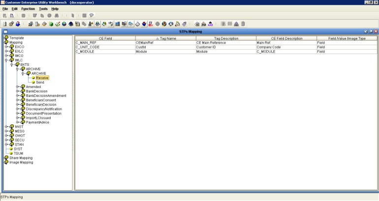 |
|                                                                                                                                                                                                                                                                                                                                                                                                                                                                                                                                                                                                                                                                                                                                                                                                                                      |      |                                                                            |
| STP Setting  Run the STP Setting function from the System Function group\.                                                                                                                                                                                                                                                                                                                                                                                                                                                                                                                                                                                                                                                                                                                                                     |      |  |
|                                                                                                                                                                                                                                                                                                                                                                                                                                                                                                                                                                                                                                                                                                                                                                                                                                      |      |                                                                            |
| Access the Assign Function tab for the Incoming Message STP type\.                                                                                                                                                                                                                                                                                                                                                                                                                                                                                                                                                                                                                                                                                                                                                                   |      | 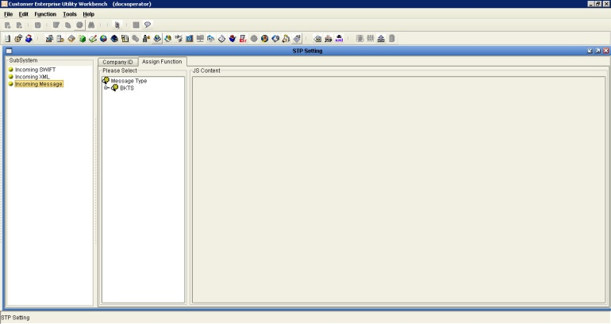 |
|                                                                                                                                                                                                                                                                                                                                                                                                                                                                                                                                                                                                                                                                                                                                                                                                                                      |      |                                                                            |
| Select the relevant message type \(i\.e\., the defined STP template\)\.  Assign the function that is to process the STP message through the stp\.setFunc method\.    <u>**EXAMPLE:**</u>  Transaction function: IMLC Archive Data  Product: Import Letters of Credit  Code:  stp\.setFunc\("IMLC Archive Data", "Import Letters of Credit"\)                                                                                                                                                                                                                                                                |      |  |
|                                                                                                                                                                                                                                                                                                                                                                                                                                                                                                                                                                                                                                                                                                                                                                                                                                      |      |                                                                            |
| Transaction Function  Run Transaction Function from the Transaction Function group\.                                                                                                                                                                                                                                                                                                                                                                                                                                                                                                                                                                                                                                                                                                                                           |      |  |
|                                                                                                                                                                                                                                                                                                                                                                                                                                                                                                                                                                                                                                                                                                                                                                                                                                      |      |                                                                            |
| Access the module and function group for which the Archive Data function is to be created\.    <u>**EXAMPLE:**</u>  Module: Import Letters of Credit  Function Group: System Maintenance\.                                                                                                                                                                                                                                                                                                                                                                                                                                                                                                          |      |  |
|                                                                                                                                                                                                                                                                                                                                                                                                                                                                                                                                                                                                                                                                                                                                                                                                                                      |      |                                                                            |
| Access or create the Archive Data function, which is used for archiving the received STP message\.  For the required parameter settings, refer to Chapter Four > Archive Data Function > Parameter Settings\.     <u>**EXAMPLE:**</u>  Function: IMLC Archive Data    <u>**NOTE:**</u>  Only one function is used for both STP archiving and manual archiving processes: the IMLC Archive Data function, which utilizes the Trx Manager Archive main program\.  |      |  |
|                                                                                                                                                                                                                                                                                                                                                                                                                                                                                                                                                                                                                                                                                                                                                                                                                                      |      |                                                                            |
| Define the STP settings for this function through the STP function component\.                                                                                                                                                                                                                                                                                                                                                                                                                                                                                                                                                                                                                                                                                                                                                       |      |  |
|                                                                                                                                                                                                                                                                                                                                                                                                                                                                                                                                                                                                                                                                                                                                                                                                                                      |      |                                                                            |
| <u>**EXAMPLE**</u>                                                                                                                                                                                                                                                                                                                                                                                                                                                                                                                                                                                                                                                                                                                                                                                |      |  |

Transaction Process

| EXAMPLE: |
| :------- |

| Send an STP message to CE\.                                                                                                                                                                                                                                                                                                                                                                                                                |      | 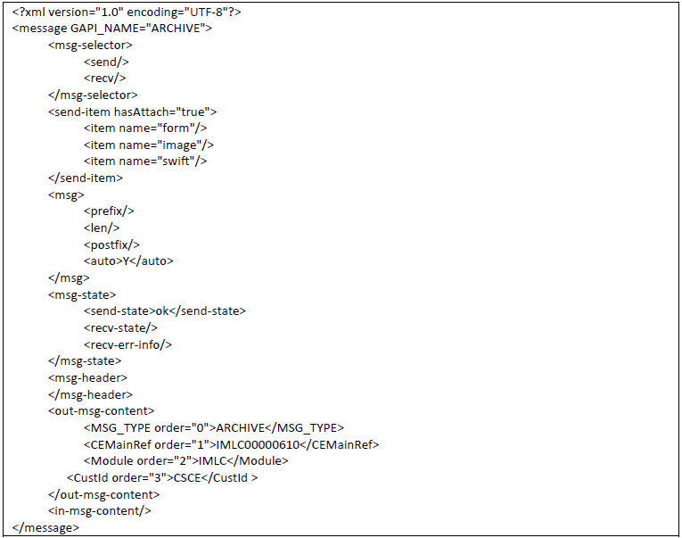 |
| ------------------------------------------------------------------------------------------------------------------------------------------------------------------------------------------------------------------------------------------------------------------------------------------------------------------------------------------------------------------------------------------------------------------------------------------ | ---- | :----------------------------------------------------------------------: |
|                                                                                                                                                                                                                                                                                                                                                                                                                                            |      |                                                                          |
| Run the Batch Manager function and display the Message Broker task manager\.  Make sure that the InGapiForm subtask has been started\.  Check the STP Log: The STP message is received successfully\.   Check the Archive Log: All transaction event records \- and related data including images, documents, mails, GAPI, etc\. \- are archived into the Backup Database and deleted from the original Transaction Database\. |      |  |
|                                                                                                                                                                                                                                                                                                                                                                                                                                            |      |                                                                          |
| Run the IMLC Inquire Archive function\.  The record, along with its associated data, can be accessed through this function\.                                                                                                                                                                                                                                                                                                         |      | 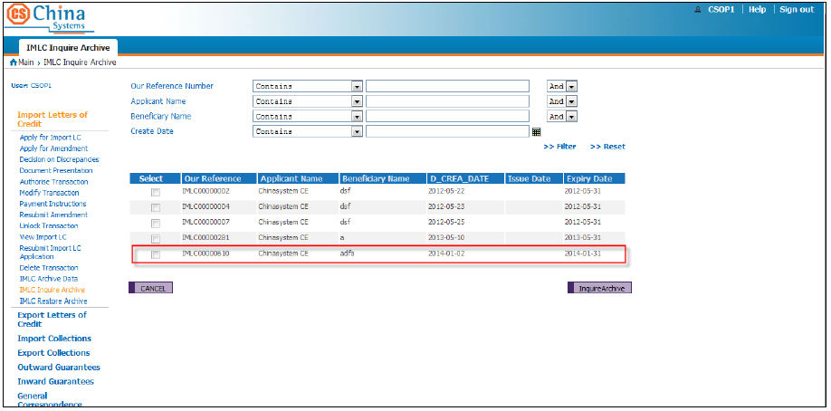 |

Sample Archiving JSP and JS Files

IMLC\_ArchiveCriteria\.jsp

IMLC\_ViewArchive\.jsp

IMLC\_ViewArchive\_Function\.JS

IMLC\_ViewArchive\_Event\.JS

IMLC\_ArchiveCriteria\.jsp

**\(Start of Code\)**

<%\-\-

/\*\*

 \* $Id: IMLC\_ArchiveCriteria\.jsp,v 1\.5 2013/12/31 02:41:03 HelenLiu Exp $

 \*

 \* @module: Import Letters of Credit \(IMLC\)

 \* @function: Archive

 \*/

\-\-%>

<%@ taglib uri = "/EXIMTAGS" prefix = "EXIMTAGS"%>

<table>

 <tr>

 <td class="FldLabel">Our Reference Number</td>

 <td><select name="OP1" id="OP1" class="CHAR\_O" style="width:170px">

 <option value="like">Contains</option>

 <option value="=">Equal to</option>

 <option value="<=">Less than or equal to</option>

 <option value=">=">More than or equal to</option>

 <option value="<">Less than</option>

 <option value=">">More than</option>

 </select></td>

 <td><input name="OP2" type="text" class="CHAR\_O" id="OP2" title="Our Reference Number" size="35" maxlength="16" style="width:250px"></td>

 <td><select name="OP3" id="OP3" class="CHAR\_O">

 <option value="AND">And</option>

 <option value="OR">Or</option>

 </select></td>

 </tr> 

 <tr>

 <td class="FldLabel">Applicant Name</td>

 <td><select name="OP4" id="OP4" class="CHAR\_O" style="width:170px">

 <option value="like">Contains</option>

 <option value="=">Equal to</option>

 <option value="<=">Less than or equal to</option>

 <option value=">=">More than or equal to</option>

 <option value="<">Less than</option>

 <option value=">">More than</option>

 </select></td>

 <td><input name="OP5" type="text" class="CHAR\_O" id="OP5" size="35" maxlength="16" style="width:250px"></td>

 <td><select name="OP6" id="OP6" class="CHAR\_O">

 <option value="AND">And</option>

 <option value="OR">Or</option>

 </select></td>

 </tr> 

 <tr>

 <td class="FldLabel">Beneficiary Name</td>

 <td><select name="OP7" id="OP7" class="CHAR\_O" style="width:170px">

 <option value="like">Contains</option>

 <option value="=">Equal to</option>

 <option value="<=">Less than or equal to</option>

 <option value=">=">More than or equal to</option>

 <option value="<">Less than</option>

 <option value=">">More than</option>

 </select></td>

 <td><input name="OP8" type="text" class="CHAR\_O" id="OP8" size="35" maxlength="35" style="width:250px"></td>

 <td><select name="OP9" id="OP9" class="CHAR\_O">

 <option value="AND">And</option>

 <option value="OR">Or</option>

 </select></td>

 </tr>

 <tr>

 <td class="FldLabel">Create Date</td>

 <td><select name="OP10" id="OP10" class="CHAR\_O" style="width:170px">

 <option value="like">Contains</option>

 <option value="=">Equal to</option>

 <option value="<=">Less than or equal to</option>

 <option value=">=">More than or equal to</option>

 <option value="<">Less than</option>

 <option value=">">More than</option>

 </select></td>

 <td><input name="OP11" type="text" class="DATE\_O" id="OP11" size="35" maxlength="35" style="width:250px"></td>

 <td>&nbsp;</td>

 </tr> 

</table>

**\(End of Code\)**

IMLC\_ViewArchive\.jsp

**\(Start of Code\)**

<%\-\-

/\*\*

 \* $Id: IMLC\_ViewArchive\.jsp,v 1\.6 2013/12/31 02:45:47 Helen Exp $

 \*

 \* @module: Import Letters of Credit \(IMLC\)

 \* @function: View Archive

 \*/

\-\-%>

<%@ taglib uri = "/EXIMTAGS" prefix = "EXIMTAGS"%>

<%@ taglib uri = "/CETAGS" prefix = "CETAGS"%>

<EXIMTAGS:IncludeFile filePath="\.\./JS/IMLC\_ViewImpLc\_Function\.js"/>

<EXIMTAGS:IncludeFile filePath="\.\./JS/IMLC\_ViewImpLc\_Event\.js"/>

<EXIMTAGS:IncludeFile filePath="\.\./JS/IMLC\_BaseFunc\.js"/>

<input name="CURRNT\_STATUS" type="hidden" class="CHAR\_O" id="CURRNT\_STATUS" title="Current Status" value="">

<input name="NXT\_STATUS" type="hidden" class="CHAR\_O" id="NXT\_STATUS" title="Next Status" value="">

<input name="C\_MAIN\_REF" type="hidden" class="CHAR\_O" id="C\_MAIN\_REF" title="CE Main Reference" value="">

<input name="ACPT\_REJ" type="hidden" class="CHAR\_O" id="ACPT\_REJ" title="Accept or Reject Application" value="">

<input name="REASON\_FOR\_REJ" type="hidden" class="CHAR\_O" id="REASON\_FOR\_REJ" title="Reason for Rejection" value="">

<input name="LC\_BALA" type="hidden" class="AMT\_O" id="LC\_BALA" title="LC Balance" value="">

<input name="BK\_MAIN\_REF" type="hidden" class="CHAR\_O" id="BK\_MAIN\_REF" title="Bank Main Reference" value="">

<input name="PARENT\_MAIN\_REF" type="hidden" class="CHAR\_O"id="PARENT\_MAIN\_REF" title="Parent Main Reference" value="">

<a href="\#" id="ViewImgLink">Hide Image\(s\)</a>

<%@ include file="\.\./\.\./\.\./\.\./include/SysViewImage\.jsp" %>

 <table>

 <tbody>

 <tr>

 <td class="FldLabel">LC Number</td>

 <td><input name="LC\_NO" type="text" class="CHAR\_P" id="LC\_NO" title="LC Number" size="35" maxlength="35"></td>

 </tr>

 <tr>

 <td class="FldLabel">Drawing Ref\. No\.</td>

 <td><input name="DRAW\_NO" type="text" class="CHAR\_P" id="DRAW\_NO" title="Drawing Ref\. No\." size="35" maxlength="35"></td>

 </tr>

 <tr>

 <td class="FldLabel">Amendment No\.</td>

 <td><input name="NO\_OF\_AMD" type="text" class="INT\_P" id="NO\_OF\_AMD" title="Number of Amendment" size="3" maxlength="3"></td>

 </tr>

 <tr>

 <td class="FldLabel">Drawing No\.</td>

 <td><input name="NO\_OF\_DRAW" type="text" class="INT\_P" id="NO\_OF\_DRAW" title="Drawing No\." size="3" maxlength="3"></td>

 </tr>

 <tr>

 <td class="FldLabel">Date of Application</td>

 <td><input name="ISSUE\_DT" type="text" class="DATE\_P" id="ISSUE\_DT" title="Date of Application" size="10" maxlength="10"></td>

 </tr>

 <tr>

 <td class="FldLabel">Our Ref Number</td>

 <td><input name="CUST\_NO" type="text" class="CHAR\_P" id="CUST\_NO" title="Our Ref Number" size="35" maxlength="35"></td>

 </tr>

 <tr>

 <td class="FldLabel">Type of LC</td>

 <td><select name="FORM\_OF\_LC" id="FORM\_OF\_LC" class="CHAR\_P" title="Type of LC">

 <EXIMTAGS:FldConv fldName="FORM\_OF\_LC" smType="false" emptyValue="" blankOption="TRUE"/>

 </select></td>

 </tr>

 <tr>

 <td class="FldLabel">LC Currency</td>

 <td><select name="LC\_CCY" id="LC\_CCY" class="CHAR\_P" title="LC Currency">

 <EXIMTAGS:DropDownElement elementType="CCY"/>

 <option value="" selected>PLEASE SELECT</option>

 </select></td>

 </tr>

 <tr>

 <td class="FldLabel">LC Amount</td>

 <td><input name="LC\_AMT" type="text" class="AMT\_P" id="LC\_AMT" title="LC Amount" size="24" maxlength="24"></td>

 </tr>

 <tr>

 <td class="FldLabel">Tolerance \- Specification % \+ / \-</td>

 <td><select name="TOL\_SPEC" id="TOL\_SPEC" class="CHAR\_O" title="Tolerance \- Specification % \+ / \-">

 <EXIMTAGS:FldConv fldName="TOL\_SPEC" smType="false" emptyValue="" blankOption="TRUE"/>

 </select></td>

 </tr>

 <tr>

 <td class="FldLabel">Positive tolerance</td>

 <td><input name="POS\_TOL" type="text" class="INT\_P" id="POS\_TOL" title="Positive tolerance" size="2" maxlength="2"></td>

 </tr>

 <tr>

 <td class="FldLabel">Negative tolerance</td>

 <td><input name="NEG\_TOL" type="text" class="INT\_P" id="NEG\_TOL" title="Negative tolerance" size="2" maxlength="2"></td>

 </tr>

 <tr>

 <td class="FldLabel">Total Exposure</td>

 <td><input name="TTL\_EXPOE" type="text" class="AMT\_P" id="TTL\_EXPOE" title="Total Exposure" size="24" maxlength="24"></td>

 </tr>

 <tr>

 <td class="FldLabel">Additional Amounts Covered</td>

 <td><textarea name="ADD\_AMT\_COVR" cols="35" rows="4" class="CHAR\_" id="ADD\_AMT\_COVR" title="Additional Amounts Covered"></textarea></td>

 </tr>

 <tr>

 <td class="FldLabel">Available By</td>

 <td><select name="AVAL\_BY" id="AVAL\_BY" class="CHAR\_M" title="Available By">

 <EXIMTAGS:FldConv fldName="AVAL\_BY" smType="false" emptyValue="" blankOption="TRUE"/>

 </select>

 <input name="MIX\_PAY\_BT" type="button" id="MIX\_PAY\_BT" title="Mixed Payment Button" value="Mixed Payment" onClick="ShowDiv\(\)"></td>

 </tr>

 <tr>

 <td class="FldLabel">Tenor Days / Type</td>

 <td><input name="TENOR\_DAYS" type="text" class="INT\_P" id="TENOR\_DAYS" title="Tenor Days" size="3" maxlength="3">

 <select name="TENOR\_TYPE" id="TENOR\_TYPE" class="CHAR\_P" title="Tenor Type">

 <EXIMTAGS:FldConv fldName="TENOR\_TYPE" smType="false" emptyValue="" blankOption="TRUE"/>

 </select>

 </td>

 </tr>

 <tr>

 <td class="FldLabel">Deferred Payment Terms</td>

 <td><textarea name="DEF\_PMT\_TERM" cols="35" rows="4" class="CHAR\_P" id="DEF\_PMT\_TERM" title="Deferred Payment Terms"></textarea></td>

 </tr>

 <tr>

 <td class="FldLabel">Drafts At</td>

 <td><textarea name="DRAFTS\_AT" cols="35" rows="3" class="CHAR\_P" id="textarea2" title="Drafts At"></textarea></td>

 </tr>

 <tr>

 <td class="FldLabel">Mixed Payment Details</td>

 <td><textarea name="MIX\_PMT\_DETL" cols="35" rows="4" class="CHAR\_P" id="MIX\_PMT\_DETL" title="Mixed Payment Details"></textarea></td>

 </tr>

 <tr>

 <td class="FldLabel">SWIFT Messages</td>

 <td><select name="SWIFT\_MSG" id="SWIFT\_MSG" class="CHAR\_O" title="SWIFT Messages">

 <option value="" selected>PLEASE SELECT</option>

 </select></td>

 </tr>

 <tr>

 <td class="FldLabel">Advice Type</td>

 <td><select name="ADV\_TYPE" id="ADV\_TYPE" class="CHAR\_O" title="Advice Type">

 <option value="" selected>PLEASE SELECT</option>

 </select></td>

 </tr>

 </tbody>

 </table>

 <table>

 <tbody>

 <tr>

 <td colspan="2" class="HeadingBg">Beneficiary</td>

 </tr>

 <tr>

 <td class="FldLabel">Name</td>

 <td><input name="BENE\_NM" type="text" class="CHAR\_P" id="BENE\_NM" title="Beneficiary Name" size="35" maxlength="35">

 <input name="BENE\_ID" type="hidden" class="CHAR\_O" id="BENE\_ID" title="Beneficiary ID" value=""></td>

 </tr>

 <tr>

 <td class="FldLabel">Location</td>

 <td><input name="BENE\_ADD1" type="text" class="CHAR\_P" id="BENE\_ADD1" title="Beneficiary Location" size="35" maxlength="35"></td>

 </tr>

 <tr>

 <td class="FldLabel">City</td>

 <td><input name="BENE\_ADD2" type="text" class="CHAR\_P" id="BENE\_ADD2" title="Beneficiary City" size="35" maxlength="35"></td>

 </tr>

 <tr>

 <td class="FldLabel">Country</td>

 <td><input name="BENE\_ADD3" type="text" class="CHAR\_P" id="BENE\_ADD3" title="Beneficiary Country" size="35" maxlength="35"></td>

 </tr>

 <tr>

 <td colspan="2" class="HeadingBg">Applicant</td>

 </tr>

 <tr>

 <td class="FldLabel">Name</td>

 <td><input name="APPL\_NM" type="text" class="CHAR\_P" id="APPL\_NM" title="Applicant Name" size="35" maxlength="35">

 <input name="APPL\_ID" type="hidden" class="CHAR\_O" id="APPL\_ID" title="Applicant ID" value="">

 </td>

 </tr>

 <tr>

 <td colspan="2" class="HeadingBg">Beneficiary Bank</td>

 </tr>

 <tr>

 <td class="FldLabel">SWIFT Address</td>

 <td><input name="BENE\_BK\_SW\_ADD" type="text" class="CHAR\_P" id="BENE\_BK\_SW\_ADD" title="Beneficiary Bank SWIFT Address" size="11" maxlength="11"></td>

 </tr>

 <tr>

 <td class="FldLabel">Name</td>

 <td><input name="BENE\_BK\_NM" type="text" class="CHAR\_P" id="BENE\_BK\_NM" title="Beneficiary Bank Name" size="35" maxlength="35">

 <\!\-\-<input name="BENE\_BK\_ID\_BT" type="button" class="CHAR\_P" id="BENE\_BK\_ID\_BT" title="Beneficiary Bank ID Button" value="\.\.\.">\-\->

 <input name="BENE\_BK\_ID" type="hidden" class="CHAR\_O" id="BENE\_BK\_ID" title="Beneficiary Bank ID" value=""></td>

 </tr>

 <tr>

 <td class="FldLabel">Location</td>

 <td><input name="BENE\_BK\_ADD1" type="text" class="CHAR\_P" id="BENE\_BK\_ADD1" title="Beneficiary Bank Location" size="35" maxlength="35"></td>

 </tr>

 <tr>

 <td class="FldLabel">City</td>

 <td><input name="BENE\_BK\_ADD2" type="text" class="CHAR\_P" id="BENE\_BK\_ADD2" title="Beneficiary Bank City" size="35" maxlength="35"></td>

 </tr>

 <tr>

 <td class="FldLabel">Country</td>

 <td><input name="BENE\_BK\_ADD3" type="text" class="CHAR\_P" id="BENE\_BK\_ADD3" title="Beneficiary Bank Country" size="35" maxlength="35"></td>

 </tr>

 <td colspan="2" class="HeadingBg">For Account Of</td>

 </tr><tr>

 <td class="FldLabel">Name</td>

 <td><input name="FOR\_AC\_OF\_NM" type="text" class="CHAR\_P" id="FOR\_AC\_OF\_NM" title="Account Of Name" size="35" maxlength="35">

 <input name="FOR\_AC\_OF\_ID" type="hidden" class="CHAR\_O" id="FOR\_AC\_OF\_ID" title="Account Of ID" value=""></td>

 </tr>

 <tr>

 <td class="FldLabel">Location</td>

 <td><input name="FOR\_AC\_OF\_ADD1" type="text" class="CHAR\_P" id="FOR\_AC\_OF\_ADD1" title="Account Of Location" size="35" maxlength="35"></td>

 </tr>

 <tr>

 <td class="FldLabel">City</td>

 <td><input name="FOR\_AC\_OF\_ADD2" type="text" class="CHAR\_P" id="FOR\_AC\_OF\_ADD2" title="Account Of  City" size="35" maxlength="35"></td>

 </tr>

 <tr>

 <td class="FldLabel">Country</td>

 <td><input name="FOR\_AC\_OF\_ADD3" type="text" class="CHAR\_P" id="FOR\_AC\_OF\_ADD3" title="Account Of Country" size="35" maxlength="35"></td>

 </table>

 <table>

 <tr>

 <td class="FldLabel">Date of Expiry</td>

 <td><input name="EXPIRY\_DT" type="text" class="DATE\_P" id="EXPIRY\_DT" title="Date of Expiry" size="10" maxlength="10"></td>

 </tr>

 <tr>

 <td class="FldLabel">Place of Expiry</td>

 <td><input name="EXPIRY\_PLC" type="text" class="CHAR\_P" id="EXPIRY\_PLC" title="Place of Expiry" size="29" maxlength="29"></td>

 </tr>

 <tbody>

 <tr>

 <td class="FldLabel">Latest Shipment Date</td>

 <td><input name="LTST\_SHIP\_DT" type="text" class="DATE\_P" id="LTST\_SHIP\_DT" title="Latest Shipment Date" size="10" maxlength="10"></td>

 </tr>

 <tr>

 <td class="FldLabel">Shipment Period</td>

 <td><textarea name="SHIP\_PRD" cols="65" rows="6" class="CHAR\_P" id="SHIP\_PRD" title="Shipment Period"></textarea></td>

 </tr>

 <tr>

 <td class="FldLabel">Partial Shipment</td>

 <td><select name="PARTIAL\_SHIP" id="PARTIAL\_SHIP" class="CHAR\_M" title="Partial Shipment">

 <EXIMTAGS:FldConv fldName="PARTIAL\_SHIP" smType="false" emptyValue="" blankOption="TRUE"/>

 </select></td>

 </tr>

 <tr>

 <td class="FldLabel">Transhipment</td>

 <td><select name="TNSHIP" id="TNSHIP" class="CHAR\_M" title="Transhipment">

 <EXIMTAGS:FldConv fldName="TNSHIP" smType="false" emptyValue="" blankOption="TRUE"/>

 </select></td>

 </tr>

 <tr>

 <td class="FldLabel">Ship From</td>

 <td><input name="LOAD\_PLACE" type="text" class="CHAR\_P" id="LOAD\_PLACE" title="Ship From" size="65" maxlength="65"></td>

 </tr>

 <tr>

 <td class="FldLabel">Port of Loading</td>

 <td><input name="LOAD\_PORT" type="text" class="CHAR\_P" id="LOAD\_PORT" title="Port of Loading" size="65" maxlength="65"></td>

 </tr>

 <tr>

 <td class="FldLabel">Port of Discharge</td>

 <td><input name="DEST\_PORT" type="text" class="CHAR\_P" id="DEST\_PORT" title="Port of Discharge" size="65" maxlength="65"></td>

 </tr>

 <tr>

 <td class="FldLabel">Ship To</td>

 <td><input name="DEST\_PLACE" type="text" class="CHAR\_P" id="DEST\_PLACE" title="Ship To" size="65" maxlength="65"></td>

 </tr>

 <tr>

 <td class="FldLabel">Description of Goods</td>

 <td><textarea name="GOODS\_DESC" cols="65" rows="100" class="CHAR\_P" id="GOODS\_DESC" style="height:250px " title="Mixed Payment Details"></textarea></td>

 </tr>

 </tbody>

 </table>

 <table>

 <tbody>

 <tr>

 <td class="FldLabel">Incoterms</td>

 <td><select name="INCOTERMS" id="INCOTERMS" class="CHAR\_P" title="Incoterms">

        <EXIMTAGS:FldConv fldName="INCOTERMS" smType="false" emptyValue="" blankOption="TRUE"/>

 </select></td>

 </tr>

 <tr>

 <td class="FldLabel">Incoterms Instructions</td>

 <td><input name="INCOTERMS\_INSTR" type="text" class="CHAR\_P" id="INCOTERMS\_INSTR" title="Incoterms Instructions" size="50" maxlength="50"></td>

 </tr>

 <tr>

 <td class="FldLabel">Documents to be Presented</td>

 <td><textarea name="DOC\_PRES" cols="65" rows="100" class="CHAR\_P" id="DOC\_PRES" style="height:250px " title="Documents to be Presented"></textarea>

 </td>

 </tr>

 <tr>

 <td class="FldLabel">Presentation Days</td>

 <td><input name="PRES\_DAYS" type="text" class="INT\_P" id="PRES\_DAYS" title="Presentation Days" size="3" maxlength="3"></td>

 </tr>

 <tr>

 <td class="FldLabel">Presentation Period Event</td>

 <td><select name="PRES\_PRD\_EVENT" id="PRES\_PRD\_EVENT" class="CHAR\_M" title="Presentation Period Event">

 <EXIMTAGS:FldConv fldName="PRES\_PRD\_EVENT" smType="false" emptyValue="" blankOption="TRUE"/>

 </select></td>

 </tr>

 <tr>

 <td class="FldLabel">Presentation Period</td>

 <td><textarea name="PRES\_PRD\_TXT" cols="35" rows="4" class="CHAR\_P" id="PRES\_PRD\_TXT" title="Presentation Period"></textarea></td>

 </tr>

 </tbody>

 </table>

 <table>

 <tbody>

 <tr>

 <td class="FldLabel">Confirmation Instruction</td>

 <td><select name="CONF\_INSTR" id="CONF\_INSTR" class="CHAR\_M" title="Confirmation Instruction">

 <EXIMTAGS:FldConv fldName="CONF\_INSTR" smType="false" emptyValue="" blankOption="TRUE"/>

 </select></td>

 </tr>

 <tr>

 <td class="FldLabel">Additional Conditions</td>

 <td><textarea name="ADDIT\_CONDITION" cols="65" rows="100" class="CHAR\_P" id="ADDIT\_CONDITION" style="height:250px " title="Additional Conditions"></textarea></td>

 </tr>

 <tr>

 <td class="FldLabel">Charge Account</td>

 <td><select name="CHG\_AC\_CCY" id="CHG\_AC\_CCY" class="CHAR\_P" title="Charge Currency">

 <EXIMTAGS:DropDownElement elementType="CCY"/>

 <option value="" selected>PLEASE SELECT</option>

 </select>

 <input name="CHG\_AC" type="text" class="CHAR\_P" id="CHG\_AC" title="Charge Account" size="20" maxlength="20">

 </td>

 </tr>

 <tr>

 <td class="FldLabel">Principle Account</td>

 <td><select name="PRINC\_CCY" id="PRINC\_CCY" class="CHAR\_P" title="Principle Currency">

 <EXIMTAGS:DropDownElement elementType="CCY"/>

 <option value="" selected>PLEASE SELECT</option>

 </select>

 <input name="PRINC\_AC" type="text" class="CHAR\_P" id="PRINC\_AC" title="Principle Account" size="20" maxlength="20">

 </td>

 </tr>

 <tr>

 <td class="FldLabel">Charges</td>

 <td><select name="CHG\_FLAG" id="CHG\_FLAG" class="CHAR\_P" title="Charges">

 <EXIMTAGS:FldConv fldName="CHG\_FLAG" smType="false" emptyValue="" blankOption="TRUE"/>

 </select></td>

 </tr>

 <tr>

 <td class="FldLabel">Forward Cover</td>

 <td><select name="FWD\_COVER" id="FWD\_COVER" class="CHAR\_O" title="Forward Cover">

 <EXIMTAGS:FldConv fldName="FWD\_COVER" smType="false" emptyValue="" blankOption="TRUE"/>

 </select></td>

 </tr>

 <tr>

 <td class="FldLabel">Customer Instructions</td>

 <td><textarea name="CUST\_INSTR" cols="35" rows="15" class="CHAR\_P" id="CUST\_INSTR" style="height:250px " title="Customer Instructions"></textarea></td>

 </tr>

 </tbody>

 </table>

 <table>

 <tbody>

 <tr>

 <td class="HeadingBg style1">1</td>

 <td align="right" class="HeadingBg"><input name="CLOSE" type="button" id="CLOSE" title="CLOSE" value="CLOSE" onClick="HideDiv\(\)"></td>

 </tr>

 <tr>

 <td class="FldLabel">Payment Type</td>

 <td><select name="SDA\_FLAG1" id="SDA\_FLAG1" class="CHAR\_O" title="Payment Type 1">

 <EXIMTAGS:FldConv fldName="SDA\_FLAG1" smType="false" emptyValue="" blankOption="TRUE"/>

 </select></td>

 </tr>

 <tr>

 <td class="FldLabel">Percentage</td>

 <td><input name="PAY\_PER1" type="text" class="INT\_P" id="PAY\_PER1" title="Percentage1" size="3" maxlength="3"></td>

 </tr>

 <tr>

 <td class="FldLabel">Amount</td>

 <td><input name="PAY\_AMT1" type="text" class="AMT\_P" id="PAY\_AMT1" title="Amount1" size="24" maxlength="24"></td>

 </tr>

 <tr>

 <td class="FldLabel">Tenor Days</td>

 <td><input name="TENOR\_DAYS1" type="text" class="INT\_P" id="TENOR\_DAYS1" title="Tenor Days1" size="3" maxlength="3">

 <select name="TENOR\_TYPE1" id="TENOR\_TYPE1" class="CHAR\_O" title="Tenor Type1">

 <EXIMTAGS:FldConv fldName="TENOR\_TYPE1" smType="false" emptyValue="" blankOption="TRUE"/>

 </select>

 <input name="TENOR\_TYPE\_21" type="text" class="CHAR\_P" id="TENOR\_TYPE\_21" title="Tenor Type\_2 1" size="35" maxlength="35"></td>

 </tr>

 <tr>

 <td colspan="2" class="HeadingBg">2</td>

 </tr>

 <tr>

 <td class="FldLabel">Payment Type</td>

 <td><select name="SDA\_FLAG2" id="SDA\_FLAG2" class="CHAR\_O" title="Payment Type 2">

 <EXIMTAGS:FldConv fldName="SDA\_FLAG2" smType="false" emptyValue="" blankOption="TRUE"/>

 </select></td>

 </tr>

 <tr>

 <td class="FldLabel">Percentage</td>

 <td><input name="PAY\_PER2" type="text" class="INT\_P" id="PAY\_PER2" title="Percentage2" size="3" maxlength="3"></td>

 </tr>

 <tr>

 <td class="FldLabel">Amount</td>

 <td><input name="PAY\_AMT2" type="text" class="AMT\_P" id="PAY\_AMT2" title="Amount2" size="24" maxlength="24"></td>

 </tr>

 <tr>

 <td class="FldLabel">Tenor Days</td>

 <td><input name="TENOR\_DAYS2" type="text" class="INT\_P" id="TENOR\_DAYS2" title="Tenor Days2" size="3" maxlength="3">

 <select name="TENOR\_TYPE2" id="TENOR\_TYPE2" class="CHAR\_O" title="Tenor Type2">

 <EXIMTAGS:FldConv fldName="TENOR\_TYPE2" smType="false" emptyValue="" blankOption="TRUE"/>

 </select>

 <input name="TENOR\_TYPE\_22" type="text" class="CHAR\_P" id="TENOR\_TYPE\_22" title="Tenor Type\_2 2" size="35" maxlength="35"></td>

 </tr>

 <tr>

 <td colspan="2" class="HeadingBg">3</td>

 </tr>

 <tr>

 <td class="FldLabel">Payment Type</td>

 <td><select name="SDA\_FLAG3" id="SDA\_FLAG3" class="CHAR\_O" title="Payment Type3">

 <EXIMTAGS:FldConv fldName="SDA\_FLAG3" smType="false" emptyValue="" blankOption="TRUE"/>

 </select></td>

 </tr>

 <tr>

 <td class="FldLabel">Percentage</td>

 <td><input name="PAY\_PER3" type="text" class="INT\_P" id="PAY\_PER3" title="Percentage3" size="3" maxlength="3"></td>

 </tr>

 <tr>

 <td class="FldLabel">Amount</td>

 <td><input name="PAY\_AMT3" type="text" class="AMT\_P" id="PAY\_AMT3" title="Amount3" size="24" maxlength="24"></td>

 </tr>

 <tr>

 <td class="FldLabel">Tenor Days</td>

 <td><input name="TENOR\_DAYS3" type="text" class="INT\_P" id="TENOR\_DAYS3" title="Tenor Days3" size="3" maxlength="3">

 <select name="TENOR\_TYPE3" id="TENOR\_TYPE3" class="CHAR\_O" title="Tenor Type3">

 <EXIMTAGS:FldConv fldName="TENOR\_TYPE3" smType="false" emptyValue="" blankOption="TRUE"/>

 </select>

 <input name="TENOR\_TYPE\_23" type="text" class="CHAR\_P" id="TENOR\_TYPE\_23" title="Tenor Type\_2 3" size="35" maxlength="35"></td>

 </tr>

 <tr>

 <td colspan="2" class="HeadingBg">4</td>

 </tr>

 <tr>

 <td class="FldLabel">Payment Type</td>

 <td><select name="SDA\_FLAG4" id="SDA\_FLAG4" class="CHAR\_O" title="Payment Type 4">

 <EXIMTAGS:FldConv fldName="SDA\_FLAG4" smType="false" emptyValue="" blankOption="TRUE"/>

 </select></td>

 </tr>

 <tr>

 <td class="FldLabel">Percentage</td>

 <td><input name="PAY\_PER4" type="text" class="INT\_P" id="PAY\_PER4" title="Percentage4" size="3" maxlength="3"></td>

 </tr>

 <tr>

 <td class="FldLabel">Amount</td>

 <td><input name="PAY\_AMT4" type="text" class="AMT\_P" id="PAY\_AMT4" title="Amount4" size="24" maxlength="24"></td>

 </tr>

 <tr>

 <td class="FldLabel">Tenor Days</td>

 <td><input name="TENOR\_DAYS4" type="text" class="INT\_P" id="TENOR\_DAYS4" title="Tenor Days4" size="3" maxlength="3">

 <select name="TENOR\_TYPE4" id="TENOR\_TYPE4" class="CHAR\_O" title="Tenor Type4">

 <EXIMTAGS:FldConv fldName="TENOR\_TYPE4" smType="false" emptyValue="" blankOption="TRUE"/>

 </select>

 <input name="TENOR\_TYPE\_24" type="text" class="CHAR\_P" id="TENOR\_TYPE\_24" title="Tenor Type\_2 4" size="35" maxlength="35"></td>

 </tr>

 <tr>

 <td colspan="2" class="HeadingBg">5</td>

 </tr>

 <tr>

 <td class="FldLabel">Payment Type</td>

 <td><select name="SDA\_FLAG5" id="SDA\_FLAG5" class="CHAR\_O" title="Payment Type 5">

 <EXIMTAGS:FldConv fldName="SDA\_FLAG5" smType="false" emptyValue="" blankOption="TRUE"/>

 </select></td>

 </tr>

 <tr>

 <td class="FldLabel">Percentage</td>

 <td><input name="PAY\_PER5" type="text" class="INT\_P" id="PAY\_PER5" title="Percentage5" size="3" maxlength="3"></td>

 </tr>

 <tr>

 <td class="FldLabel">Amount</td>

 <td><input name="PAY\_AMT5" type="text" class="AMT\_P" id="PAY\_AMT5" title="Amount5" size="24" maxlength="24"></td>

 </tr>

 <tr>

 <td class="FldLabel">Tenor Days</td>

 <td><input name="TENOR\_DAYS5" type="text" class="INT\_P" id="TENOR\_DAYS5" title="Tenor Days5" size="3" maxlength="3">

 <select name="TENOR\_TYPE5" id="TENOR\_TYPE5" class="CHAR\_O" title="Tenor Type 5">

 <EXIMTAGS:FldConv fldName="TENOR\_TYPE5" smType="false" emptyValue="" blankOption="TRUE"/>

 </select>

 <input name="TENOR\_TYPE\_25" type="text" class="CHAR\_P" id="TENOR\_TYPE\_25" title="Tenor Type\_2 5" size="35" maxlength="35"></td>

 </tr>

 <tr>

 <td colspan="2" class="HeadingBg">6</td>

 </tr>

 <tr>

 <td class="FldLabel">Payment Type</td>

 <td><select name="SDA\_FLAG6" id="SDA\_FLAG6" class="CHAR\_O" title="Payment Type 6">

 <EXIMTAGS:FldConv fldName="SDA\_FLAG6" smType="false" emptyValue="" blankOption="TRUE"/>

 </select></td>

 </tr>

 <tr>

 <td class="FldLabel">Percentage</td>

 <td><input name="PAY\_PER6" type="text" class="INT\_P" id="PAY\_PER6" title="Percentage6" size="3" maxlength="3"></td>

 </tr>

 <tr>

 <td class="FldLabel">Amount</td>

 <td><input name="PAY\_AMT6" type="text" class="AMT\_P" id="PAY\_AMT6" title="Amount6" size="24" maxlength="24"></td>

 </tr>

 <tr>

 <td class="FldLabel">Tenor Days</td>

 <td><input name="TENOR\_DAYS6" type="text" class="INT\_P" id="TENOR\_DAYS6" title="Tenor Days6" size="3" maxlength="3">

 <select name="TENOR\_TYPE6" id="TENOR\_TYPE6" class="CHAR\_O" title="Tenor Type6">

 <EXIMTAGS:FldConv fldName="TENOR\_TYPE6" smType="false" emptyValue="" blankOption="TRUE"/>

 </select>

 <input name="TENOR\_TYPE\_26" type="text" class="CHAR\_P" id="TENOR\_TYPE\_26" title="Tenor Type\_2 6" size="35" maxlength="35"></td>

 </tr>

 <tr>

 <td colspan="2" class="FldLabel">&nbsp;</td>

 </tr>

 <tr>

 <td class="FldLabel">Total Amount</td>

 <td><input name="TTL\_PAY\_AMT" type="text" class="AMT\_P" id="PAY\_AMT62" title="Amount6" size="24" maxlength="24"></td>

 </tr>

 </tbody>

 </table>

**\(End of Code\)**

IMLC\_ViewArchive\_Function\.JS

**\(Start of Code\)**

// $Id: IMLC\_ViewArchive\_Function\.js,v 1\.6 2013/12/31 03:01:08 helenliu Exp $

function Get\_CURRNT\_STATUS\(\)\{

 try \{

 //        setFldValue\("CURRNT\_STATUS","Issued LC"\);

 \} 

 catch \(e\) \{

 showExcpt\("IMLC\_ViewArchive\_Function", e\);

 \}

\}

function Get\_NXT\_STATUS\(\)\{

 try \{

 //        setFldValue\("NXT\_STATUS", ""\);

 \} 

 catch \(e\) \{

 showExcpt\("IMLC\_ViewArchive\_Function", e\);

 \}

\}

**\(End of Code\)**

IMLC\_ViewArchive\_Event\.JS

**\(Start of Code\)**

// $Id: IMLC\_ViewArchive\_Event\.js,v 1\.6 2013/12/31 03:01:08 HelenLiu Exp $

function OnInit\(\)\{

 try \{

 if \(SYS\_FUNCTION\_TYPE == "EC" :: SYS\_FUNCTION\_TYPE == "RE" :: SYS\_FUNCTION\_TYPE == "IQ" :: SYS\_FUNCTION\_TYPE == "DM"\) \{

 SYS\_CONFIRM\_FLAG = true;

 GetImageList\(\);

 \}

 else \{

 if \(SYS\_ERROR\.length == 0\) \{

 SYS\_CONFIRM\_FLAG = false;

 InitValue\(\);

 \}

 \}

 \} 

 catch \(e\) \{

 showExcpt\("IMLC\_ViewArchive\_Event", e\);

 \}

\}

function InitValue\(\)\{

 try \{

 \} 

 catch \(e\) \{

 showExcpt\("IMLC\_ViewArchive\_Event", e\);

 \}

\}

function ChkTrxData\(\)\{

 try \{

 return true;

 \} 

 catch \(e\) \{

 showExcpt\("IMLC\_ViewArchive\_Event", e\);

 \}

\}

function ConfirmTrx\(\)\{

 try \{

 //Get\_CURRNT\_STATUS\(\);

 //Get\_NXT\_STATUS\(\);

 \} 

 catch \(e\) \{

 showExcpt\("IMLC\_ViewArchive\_Event", e\);

 \}

\}

function InitFldEvt\(\)\{

 try \{

 \} 

 catch \(e\) \{

 showExcpt\("IMLC\_ViewArchive\_Event", e\);

 \}

\}

**\(End of Code\)**

Glossary

Glossary

a

| ***Application Server***    | Server where the CE system is actually deployed and where CE processes the business logic and parameter operations\.                                   |
| --------------------------- | ------------------------------------------------------------------------------------------------------------------------------------------------------ |
|                             |                                                                                                                                                        |
| ***Archiving***             | The process of transferring transaction records from the Transaction Database to the Backup Database\.                                                 |
|                             |                                                                                                                                                        |
| ***Auto Archiving***        | Mode of archiving in which records are automatically archived by batch according to a set of defined criteria\.  This is also called Batch Archiving\. |
|                             |                                                                                                                                                        |
| ***Archive Data Function*** | Function used for archiving records\.                                                                                                                  |

B

| ***Batch Archiving*** | See Auto Archiving\.                                            |
| --------------------- | --------------------------------------------------------------- |
|                       |                                                                 |
| ***Business Unit***   | A processing center or a branch unit of a bank\-country group\. |

C

| ***CE Utility***                 | Short for Customer Enterprise Utility Workbench\.  This is the main tool for building parameters in CE\.                                                                                                                         |
| -------------------------------- | -------------------------------------------------------------------------------------------------------------------------------------------------------------------------------------------------------------------------------- |
|                                  |                                                                                                                                                                                                                                  |
| ***Customer Enterprise \(CE\)*** | The Eximbills business\-to\-business \(B2B\) solution that provides bank customers with a convenient and secure single window for processing and inquiring on all their trade finance, open account, and payments transactions\. |

D

| ***Database*** | An application used for the management, storage, and retrieval of data\.                                                                           |
| -------------- | -------------------------------------------------------------------------------------------------------------------------------------------------- |
|                |                                                                                                                                                    |
| ***Document*** | Also referred to as form\.  It is one of the types of output that can be generated in HTML, PDF, WORD, or EXCEL format by a transaction function\. |

E

| ***End\-user*** | The actual user running the CE business functions\.                                                                                 |
| --------------- | ----------------------------------------------------------------------------------------------------------------------------------- |
|                 |                                                                                                                                     |
| ***Eximbills*** | The flagship product of China Systems, which provides support for advanced e\-commerce, open account, and trade\-related services\. |

F

| ***Field***    | The smallest unit that can hold data\.                                                                                                                                                       |
| -------------- | -------------------------------------------------------------------------------------------------------------------------------------------------------------------------------------------- |
|                |                                                                                                                                                                                              |
| ***Function*** | A unified set of elements, operations, and configurations that produce a target setting, process, and/or output\. This typically refers to a CE Utility function or a transaction function\. |

I

| ***Inquire Archived Data Function*** | Function used for inquiring into records that are stored in the Archive file\. |
| ------------------------------------ | ------------------------------------------------------------------------------ |

M

| ***Manual Archiving*** | Mode of archiving in which records are manually archived per module according to a set of defined criteria\.  In addition, records received via STP can also be archived through this mode\.                                                                     |
| ---------------------- | ---------------------------------------------------------------------------------------------------------------------------------------------------------------------------------------------------------------------------------------------------------------- |
|                        |                                                                                                                                                                                                                                                                  |
| ***Meta Data***        | The parameter data, or simply parameters, that are defined in the CE Utility\.                                                                                                                                                                                   |
|                        |                                                                                                                                                                                                                                                                  |
| ***Module***           | A group of functions that perform interrelated processes and operate under a general principle or objective \(e\.g\., a system module, which is essential to system processes; a business or transaction module, which pertains to a bank service or product\)\. |

P

| ***Parameter***       | Any user\-controlled configuration that defines a factor or logic within a set of interrelated operations; performs a specific action in a group of processes; or produces a categorical result or setting\. |
| --------------------- | ------------------------------------------------------------------------------------------------------------------------------------------------------------------------------------------------------------ |
|                       |                                                                                                                                                                                                              |
| ***Parameter Files*** | See XML*\.*                                                                                                                                                                                                  |

R

| ***Recovery***                       | The process of retrieving archived records from the Backup Database\.                                          |
| ------------------------------------ | -------------------------------------------------------------------------------------------------------------- |
|                                      |                                                                                                                |
| ***Restore Archived Data Function*** | Function used for retrieving transactions from the Backup Database, and adding these back to the master file\. |

S

| ***SQL***  | Stands for Structured Query Language\.  This is a standard interactive and programming language for retrieving and updating data in the database\. |
| ---------- | -------------------------------------------------------------------------------------------------------------------------------------------------- |

X

| ***XML***                    | Stands for Extensible Markup Language\.  This is the format used by CE for the communication between the client \(browser\) and the server\. |
| ---------------------------- | -------------------------------------------------------------------------------------------------------------------------------------------- |
|                              |                                                                                                                                              |
| ***XML Generator Function*** | The CE Utility function that is used to generate the corresponding XML files for a specific parameter setting\.                              |

-----

