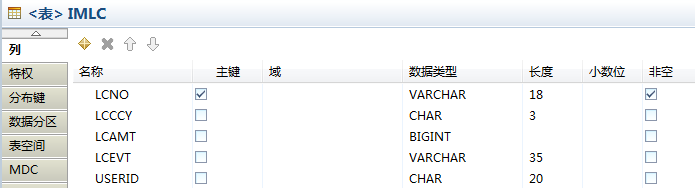
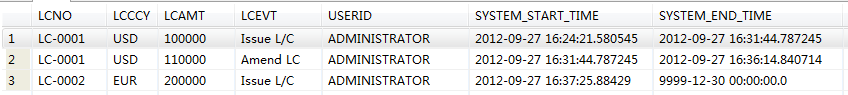

{width="2.89375in" height="1.0604166666666666in"}

简要介绍DB2 V10.1上新出的Time Travel
Query技术，探讨在Eximbills产品中使用该技术实现Audit
Log相关功能的可能途径。

Copyright  2012

All rights reserved. This product and related documentation are
protected by copyright and distributed under licenses restricting its
use, copying, distribution and decompilation. No part of this product or
related documentation may be reproduced in any form by any means without
the prior written authorization of and its licensors, if any.

  Authors:   Dayu Bian
  ---------- --------------------
  Version:   1.0.0
  Date:      September 27, 2012
  Project:   Audit Log Report

:

  File name:            
  --------------------- ------------------
  Path name:            
  Internal reference:   Audit Log Report

DOCUMENT HISTORY

  **[Version]{.underline}**   **[Date]{.underline}**   **[Narrative]{.underline}**
  --------------------------- ------------------------ -----------------------------
  1.0.0                       September 26, 2012       First Draft
                                                       
                                                       

Contents

1 背景描述 4

2 设置步骤 5

2.1 增加并指定系统时间字段 5

2.2 创建历史记录表 5

2.3 关联历史记录表 6

3 验证Time Travel Query效果 7

4 小结 8

Sign-off Sheet 9

背景描述
========

在上一篇报告[[《Get Data from DB Log -
Oracle.docx》]{.underline}](Get%20Data%20from%20DB%20Log%20-%20Oracle.docx)中，介绍了Oracle数据库的Flashback技术。利用该技术，应用程序与报表工具可以直接使用SQL语句读取到数据库中记录的变化历史资料，从而给Audit
Log功能的实现提供了便利。

IBM的DB2也不甘落后，在今年推出的V10.1上，提供了一个与Oracle
Flashback功能相似的技术------Time Travel
Query，[[这里]{.underline}](http://www-01.ibm.com/software/data/db2/linux-unix-windows/time-travel-query.html)有相关介绍。

在具体的设置方法上，DB2与Oracle并不一样。在DB2上，对于需跟踪历史记录的table，采用的是定义相应的时序表（temporal
table）的方法。

在所提供的具体功能上，DB2与Oracle也不尽相同。在DB2上，一共提供了三种类型的时序表------

-   以数据库系统时间为基准的System-period temporal tables(STT);

-   以应用中的业务时间为基准的Application-period temporal tables(ATT);

-   结合STT与ATT为一体的Bitemporal tables。

对于应用设计而言，DB2的Time Travel
Query在功能上似乎更胜一筹。因为目前我们只对如何实现Audit
Log感兴趣，所以本报告将只涉及到STT的使用方法。

设置步骤
========

假设有一个名为IMLC的表，现有如下几个简单字段------

{width="6.0in"
height="1.6229166666666666in"}

下面，我们将以此表为基础、分三个步骤设置对STT------

**增加并指定系统时间字段**
--------------------------

使用下面的SQL为IMLC增加用于存放系统时间的字段：

**ALTER** **TABLE** ADMINISTRATOR.IMLC

**ADD** **COLUMN** SYSTEM\_START\_TIME **TIMESTAMP**(12) **NOT**
**NULL** GENERATED ALWAYS **AS** **ROW** **BEGIN**

**ADD** **COLUMN** SYSTEM\_END\_TIME **TIMESTAMP**(12) **NOT** **NULL**
GENERATED ALWAYS **AS** **ROW** **END**

**ADD** **COLUMN** TRANS\_ID **TIMESTAMP**(12) GENERATED ALWAYS **AS**
**TRANSACTION** START ID;

其中

-   SYSTEM\_START\_TIME为System-period start time，具体含义为：This
    column is the system time when this row came into existence (the
    time of the original insert or update operation that created this
    version of the row)

-   SYSTEM\_END\_TIME为System-period end time, 具体含义为：This column
    is the system time when this row was modified with either a　newer
    version of the row or deleted from the table. The setting of
    this　timestamp to the following value indicates it is the current
    version of the row:　9999-12-30-00:00.00

-   TRANS\_ID为Transaction start ID，具体含义为：This column is the
    unique identifier for the transaction that modified or inserted the
    row; it can be used to find all records affected by the same
    transaction across multiple tables using Time Travel Query. A
    database can have many transactions occurring in a relatively short
    time span (milliseconds). To uniquely identify different
    transactions, a timestamp value provides subsecond granularity.

使用下面的SQL为IMLC指定系统时间字段：

**ALTER** **TABLE** ADMINISTRATOR.IMLC

**ADD** PERIOD SYSTEM\_TIME ( SYSTEM\_START\_TIME, SYSTEM\_END\_TIME );

创建历史记录表
--------------

使用下面的SQL语句为IMLC创建历史记录表:

CREATE TABLE IMLC\_STT LIKE IMLC;

ALTER TABLE IMLC\_STT APPEND ON;

后一条语句为可选项，但可提高IMLC\_STT表的insert性能。

关联历史记录表
--------------

使用下面的SQL将两张表关联起来：

> ALTER TABLE IMLC ADD VERSIONING USE HISTORY TABLE IMLC\_STT;

至此，有关IMLC的STT设置就全部完成了。

验证Time Travel Query效果
=========================

现在（2012年9月27日），我们对IMLC依次进行如下数据操作：

-   Insert一笔记录，LCNO为LC-0001;

-   Update上笔记录；

-   Delete上笔记录；

-   Insert另一笔记录，LCNO为LC-0002.

然后，我们运行如下Time Travel Query语句：

select \* from IMLC

for system\_time between timestamp(\'2012-09-27\') and
timestamp(\'9999-12-31\');

下图为运行结果：

{width="6.0in"
height="0.6722222222222223in"}

显然，上述结果与Oracle Flashback Version
Query基本上是类似的,DELETE的结果也反映在SYSTEM\_END\_TIME字段上（Oracle上相应字段为versions\_endtime）；但在版本记录被删除或修改之前，DB2上的值为9999-12-30，而Oracle上则是null。

 小结
====

DB2 V10.1上的Time Travel Query功能，与Oracle上的Flashback
Technology极其相似，都是只需在数据库上进行一些设置就可打开这些功能；而且，其接口形式都为SQL，故兼容于基于JDBC的各种报表工具，应用方面需要进行的改动也较小，可做为设计Audit
Log Report功能的备选方案。

Sign-off Sheet {#sign-off-sheet .ListParagraph}
==============

  Internal Reference:     
  ----------------------- --
  Version:                
  Authors:                
  Sign off Required by:   

  [Reviewed by]{.underline}   [Position / Comment]{.underline}   [Signature]{.underline}   [Date]{.underline}
  --------------------------- ---------------------------------- ------------------------- --------------------
                                                                                           
                                                                                           
                                                                                           
                                                                                           
                                                                                           
                                                                                           
                                                                                           
                                                                                           
                                                                                           
