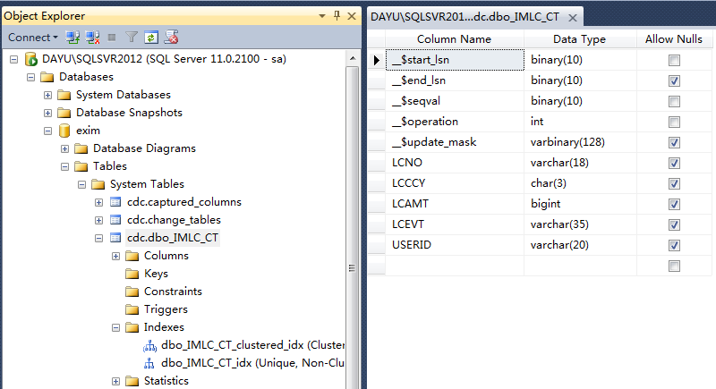
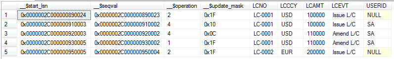
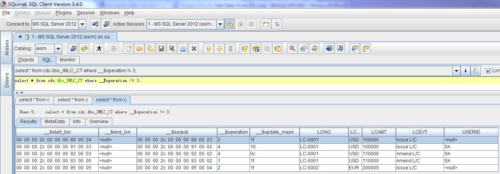

{width="2.89375in" height="1.0604166666666666in"}

简要介绍MS SQL Server 2008上出现的Change Data
Capture功能，探讨在Eximbills产品中使用该技术实现Audit
Log相关功能的可能途径。

Copyright  2012

All rights reserved. This product and related documentation are
protected by copyright and distributed under licenses restricting its
use, copying, distribution and decompilation. No part of this product or
related documentation may be reproduced in any form by any means without
the prior written authorization of and its licensors, if any.

  Authors:   Dayu Bian
  ---------- --------------------
  Version:   1.0.0
  Date:      September 29, 2012
  Project:   Audit Log Report

:

  File name:            
  --------------------- ------------------
  Path name:            
  Internal reference:   Audit Log Report

DOCUMENT HISTORY

  **[Version]{.underline}**   **[Date]{.underline}**   **[Narrative]{.underline}**
  --------------------------- ------------------------ -----------------------------
  1.0.0                       September 28, 2012       First Draft
                                                       
                                                       

Contents

1 背景描述 4

2 设置步骤 5

2.1 Enable Change Data Capture for the Database exim 5

2.2 Enable Change Data Capture for the Table IMLC 5

3 验证效果 8

4 小结 10

Sign-off Sheet 11

背景描述
========

在上两篇报告[[《Get Data from DB Log -
Oracle.docx》]{.underline}](file:///C:\Users\Administrator\Work\DB%20History%20Data\Get%20Data%20from%20DB%20Log%20-%20Oracle.docx)、《[[Get
Data From DB Log --
DB2]{.underline}](Get%20Data%20from%20DB%20Log%20-%20DB2.docx)》中，介绍了Oracle数据库的Flashback技术及DB2
V10的Time Travel
Query功能。利用这些技术，应用程序与报表工具可以直接使用SQL语句读取到数据库中记录的变化历史资料，从而给Audit
Log功能的实现提供了便利。

至于MS SQL Server，自2008版本起，推出了一个名为Change Data
Capture的功能，同样也是在后台通过读取数据库日志的方法、自动生成数据库中记录的变化历史资料。[[这儿]{.underline}](http://msdn.microsoft.com/en-us/library/cc645937.aspx)有相关介绍，当中有一幅图（如下）描述了其基本实现原理。

{width="2.4784722222222224in"
height="4.157638888888889in"}

设置步骤
========

假设在数据库exim下有一个名为dbo.IMLC的表，现有如下几个简单字段------

{width="4.042230971128609in"
height="1.458536745406824in"}

下面，我们将以此表为基础、分两个步骤设置Change Data Capture------

Enable Change Data Capture for the Database exim
------------------------------------------------

执行以下Transact-SQL：

> USE exim
>
> GO
>
> EXEC sys.sp\_cdc\_enable\_db
>
> GO

Enable Change Data Capture for the Table IMLC
---------------------------------------------

执行以下Transact-SQL:

> USE exim
>
> GO
>
> EXEC sys.sp\_cdc\_enable\_table
>
> \@source\_schema = N\'dbo\',
>
> \@source\_name = N\'IMLC\',
>
> \@role\_name = NULL,
>
> \@supports\_net\_changes = 1
>
> GO

至此，有关IMLC的Data Change
Capture设置就全部完成了，系统还为此自动生成了两个Table-valued函数及一个Change
table:

{width="5.386169072615923in"
height="5.980002187226597in"}

{width="6.0in"
height="3.2625in"}

验证效果
========

现在（2012年9月29日），我们对IMLC依次进行如下数据操作：

-   Insert一笔记录，LCNO为LC-0001;

-   Update上笔记录；

-   Delete上笔记录；

-   Insert另一笔记录，LCNO为LC-0002.

然后，我们运行如下Transact-SQL：

USE exim;

GO

DECLARE \@begin\_time datetime, \@end\_time datetime, \@from\_lsn
binary(10), \@to\_lsn binary(10);

\-- Obtain the beginning of the time interval.

SET \@begin\_time = GETDATE() -1;

\-- Obtain the end of the time interval.

SET \@end\_time = GETDATE();

\-- Map the time interval to a change data capture query range.

SET \@from\_lsn = sys.fn\_cdc\_map\_time\_to\_lsn(\'smallest greater
than or equal\', \@begin\_time);

SET \@to\_lsn = sys.fn\_cdc\_map\_time\_to\_lsn(\'largest less than or
equal\', \@end\_time);

\-- Return the net changes occurring within the query window.

SELECT \* FROM cdc.fn\_cdc\_get\_all\_changes\_dbo\_IMLC(\@from\_lsn,
\@to\_lsn, \'all\');

得到的结果如下图：

{width="6.0in"
height="0.9104166666666667in"}

其中，\_\_\$operation的值的含义为：

> 2 -- Insert
>
> 4 -- Update
> (一次Update产生before/after两笔记录，由\_\_\$update\_mask区分)
>
> 1 -- Delete

此外，通过JDBC/SQL直接访问Change Table也可得到与上面类似的结果：

{width="6.0in"
height="2.088888888888889in"}

 小结
====

MS SQL Server上的Change Data Capture功能，与Oracle上的Flashback
Technology、DB2上的Time Travel
Query极其相似，都是只需在数据库上进行一些设置就可打开这些功能；而且，其接口形式都为SQL，故兼容于基于JDBC的各种报表工具，应用方面需要进行的改动也较小，可做为设计Audit
Log Report功能的备选方案。

Sign-off Sheet {#sign-off-sheet .ListParagraph}
==============

  Internal Reference:     
  ----------------------- --
  Version:                
  Authors:                
  Sign off Required by:   

  [Reviewed by]{.underline}   [Position / Comment]{.underline}   [Signature]{.underline}   [Date]{.underline}
  --------------------------- ---------------------------------- ------------------------- --------------------
                                                                                           
                                                                                           
                                                                                           
                                                                                           
                                                                                           
                                                                                           
                                                                                           
                                                                                           
                                                                                           
